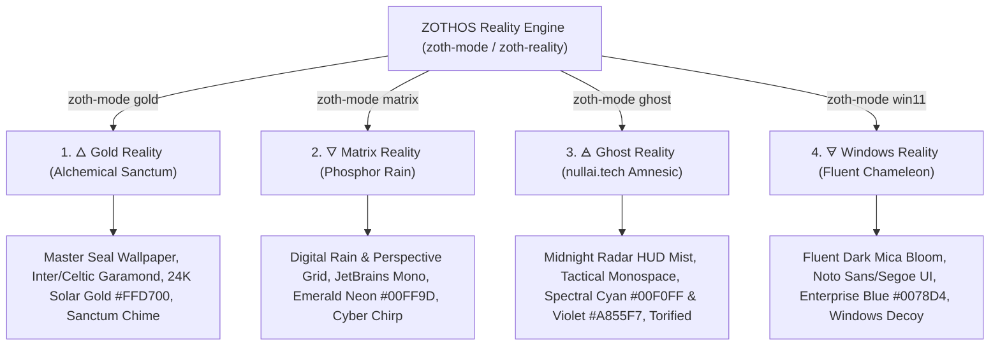

# 🜂 ZOTHOS Linux 🜄
### *The Sovereign Alchemical Intelligence & Offensive Security Operating System*
> *"As above, so below; as code, so mind."*

```text
       ▲             ZOTHOS Linux 1.0 (Azoth Sovereign Transmutation)
      ▲ ▲            -------------------------------------------------
     ▲   ▲           Desktop Core:     KDE Plasma 6 (24K Hermetic Gold & Obsidian)
    ▲  ☉  ▲          Base Runtime:     Debian 13 (Trixie) + Kali Rolling + Parrot OS Dual APT Pinning
   ▲   |   ▲         Kernel:           Linux 6.12+ Hardened AMD64
  ▲ 🜂  ☿  🜄 ▲        Offensive Stack:  213+ Verified Security, AD & Cloud Pentesting Tools
 ▲             ▲       Frontier AI:      Nous Hermes + NullAI HexStrike + Ollama + ComfyUI + AGY SDK
▲═══════🜁═══════▲      Stealth Engine:   nullai.tech Ghostmode [Amnesic Tor & Ephemeral RAM Wipe]
  \   🜃     /        Undercover Guise: Windows 11 Fluent Chameleon [Sub-Second Switch]
   \   |   /         Audio Engine:     Zoth Hermetic Audio Studio (Preloaded Lossless Classical Deck)
    \  🝘  /          Installer:        Calamares 24K Gold Sovereign Graphical Installer
     \   /           Architecture:     x86_64 Hybrid UEFI / BIOS Live ISO
      ▼
```

---

## ✦ System Manifesto & Vision

**ZOTHOS** is a sovereign Linux distribution engineered at the nexus of esoteric aesthetics, military-grade operational security, frontier agentic artificial intelligence, and offensive security parity.

1. **24K Hermetic Gold on Obsidian Glass**: Tailored KDE Plasma 6 desktop featuring pure circular gold medallions (`Zoth-Hermetic`), custom golden cursor trails, translucent gold drag-selection boxes, and a minimalist Celtic typography wallpaper.
2. **Offensive Security Parity (Kali + Parrot)**: Tri-repository architecture leveraging Debian Trixie stability with pinned Kali Rolling and Parrot Security repositories. Over **213+ verified tools** pre-configured for Active Directory exploitation, web auditing, binary reverse engineering, wireless warfare, and credential extraction.
3. **Ghostmode (nullai.tech influence)**: Military-grade amnesic operational security, automatic MAC address randomization, transparent Tor traffic routing, randomized machine hostname, and ephemeral RAM cache scrubbing on lock/shutdown.
4. **Incognito Chameleon (Windows 11 Cloak)**: Sub-second desktop transformation into a Windows 11 Enterprise environment (taskbar layout, Fluent GTK theme, Segoe typography, decoy PowerShell shell, decoy enterprise icons) for physical operational security in hostile or corporate environments.
5. **Frontier & Autonomous AI Forge**: Sovereign local inference engines (Ollama, vLLM, llama.cpp, ComfyUI) fused with underground AI red-teaming harnesses (Garak, PyRIT, Promptfoo, inspect_ai), multi-agent orchestrators (Nous Hermes, Google AGY SDK), and autonomous terminals ([NullAI HexStrike](https://github.com/NullAITech/NullAI-HexStrike-AI-Terminal)).
6. **Zoth Hermetic Audio Studio**: Dedicated desktop audio deck preloaded with classical focus and alchemical compositions (Satie, Chopin, Debussy, Bach) with a real-time Web Audio API spectrum visualizer.

---

## ✦ The Four Operating Realities (Sub-Second Reality Switcher)

ZOTHOS allows instant switching between four distinct operating realities with no logout or reboot required:



| Reality | CLI Command | Wallpaper Asset | Font & Color Accents | Operational Invariants |
| :--- | :--- | :--- | :--- | :--- |
| **1. Gold (Alchemical Sanctum)** | `zoth-mode gold` | `zoth-gold-master.png` | Inter / Celtic Garamond<br/>Solar Gold `#FFD700`, Dark Obsidian `#080A0E` | Default sovereign workspace, full tool access, Fastfetch hermetic seal status, `gold-sanctum.wav` audio cue |
| **2. Matrix (Phosphor Rain)** | `zoth-mode matrix` | `hermetic-matrix.png` | JetBrains Mono (Hacker Mono)<br/>Phosphor Emerald `#00FF9D`, Void Panels `#020603` | Cyberpunk terminal workstation, active digital rain, low-latency development, `matrix-chirp.wav` audio cue |
| **3. Ghost (Amnesic Stealth)** | `zoth-mode ghost` | `ghostmode-nullai.png` | JetBrains Mono / Slate<br/>Spectral Cyan `#00F0FF` & Violet `#A855F7` | Transparent Tor network routing, MAC randomization, machine hostname cloaking, RAM cache drop, `ghost-vapor.wav` audio cue |
| **4. Windows (Fluent Chameleon)** | `zoth-mode win11` | `win11-bloom.jpg` | Noto Sans / Segoe UI<br/>Windows Blue `#0078D4`, Dark Mica `#202020` | Windows 11 Fluent layout, decoy PowerShell profile, enterprise corporate disguise for physical OPSEC, `win11-fluent.wav` audio cue |

---

## ✦ Built-in Tools & Applications

### 1. Active Directory & Enterprise Red Team (Bake-in Default)
- **`certipy` / `certipy-ad`**: Active Directory Certificate Services (AD CS) enumeration and abuse tool (ESC1–ESC13).
- **`kerbrute`**: Fast Kerberos pre-auth brute-forcing, user enumeration, and TGT harvesting written in Go.
- **`coercer`**: Automatic Windows RPC authentication coercer (MS-RPRN, MS-EFSR, MS-DFSNM).
- **`peass` (`linPEAS` & `winPEAS`)**: Privilege Escalation Awesome Scripts Suite preloaded in `/usr/bin/linpeas` and `/usr/share/peass/`.
- **`bloodhound` & `neo4j`**: Visual Active Directory domain attack path analysis.
- **`impacket-scripts` & `responder`**: Complete NTLM relaying, SMB capture, and RPC protocol manipulation.
- **`evil-winrm` & `netexec`**: Modern Windows remote execution and post-exploitation.

### 2. Next-Gen Web Recon & Attack Surface
- **`httpx`**: ProjectDiscovery multi-purpose HTTP probe toolkit (resolutions, ports, TLS, status, technology detection).
- **`subfinder`**: Fast passive subdomain discovery aggregating 40+ OSINT sources.
- **`katana`**: Next-generation crawler and spidering framework with headless browser parsing.
- **`gowitness`**: Automated web screenshotting utility via headless Chromium for rapid visual triage.
- **`trufflehog`**: High-entropy secret and private key scanner with live key verification across repos and filesystems.
- **`caido`**: Modern, fast Rust-based intercepting proxy and web security suite.
- **`burpsuite` & `zaproxy`**: Industry standard web vulnerability inspection suites.
- **`sqlmap`, `ffuf`, `feroxbuster`, `nikto`, `commix`**: High-speed fuzzers and injection audit tools.

### 3. Sovereign Privacy, Encryption & OPSEC
- **`keepassxc`**: Secure offline password and credential vault with YubiKey / hardware key support. Desktop entry: `Zoth KeePassXC Vault`.
- **`veracrypt`**: Plausibly deniable multi-platform disk and file container encryption with hidden volumes. Desktop entry: `Zoth VeraCrypt Vault`.
- **`onionshare`**: Anonymous peer-to-peer file sharing, private chat, and ephemeral site hosting over Tor. Desktop entry: `Zoth OnionShare Privacy`.
- **`age`**: Modern, simple file encryption tool with UNIX philosophy.
- **`bleachbit`**: Deep system cache, memory, and browser artifact scrubber.
- **`tor` & `torsocks`**: Sovereign onion network routing for all terminal applications.
- **`macchanger` & `firejail`**: Hardware identity cloaking and application sandboxing.

### 4. Frontier AI & Autonomous Agent Forge
- **[Zoth Studio v2](https://github.com/NullAITech/zoth-studio-v2)** (`/opt/zoth-studio`): Zero-egress sovereign agent development studio featuring 37 native workstations, 25 in-browser WebGPU developer utilities, Lucy Netrunner Oracle with biomorphic STDP synaptic memory, tri-agent Byzantine consensus arena, and responsive WindowCarousel interfaces.
- **[NullAI HexStrike AI Terminal](https://github.com/NullAITech/NullAI-HexStrike-AI-Terminal)**: Sovereign cybersecurity workstation with neural MITRE ATT&CK mapping, async FastAPI core, and retro CRT shader UI.
- **`hermes`**: [Nous Research Hermes Agent](https://github.com/NousResearch/Hermes-Agent) autonomous agent and skill ecosystem.
- **`ollama` & `vllm`**: High-throughput local LLM execution on CPU and NVIDIA/AMD GPUs.
- **`comfyui`**: Visual node-based workflow for Stable Diffusion, FLUX, and latent image generation.
- **`garak` & `pyrit`**: Generative AI red-teaming, prompt injection, and jailbreak security auditing.
- **`promptfoo` & `inspect_ai`**: Automated LLM evaluation and safety compliance suites.
- **`claude`, `codex`, `grok`, `opencode`**: Unified terminal interfaces to frontier coding and reasoning models.

### 5. Media Creation, Audio & Modern TUIs
- **`zoth-music`**: Zoth Hermetic Audio Studio with real-time spectrum visualizer, rotating 24K gold medallion, and preloaded classical focus compositions.
- **`maya`**: Maya Linux Video Studio Pro with 3D device mockups (iPhone 17 Pro, MacBooks), screen recording, and kinetic subtitles.
- **`lazydocker` & `lazygit`**: Interactive terminal dashboards for container and Git management.
- **`yazi`**: Blazing fast async terminal file manager written in Rust with inline image preview support.
- **`glow`**: Terminal markdown reader and documentation browser by Charm.
- **`doggo`**: Interactive, modern DNS client with JSON output and DoH/DoT support.
- **`trippy` (`trip`)**: Real-time network diagnostic combining traceroute and ping in a reactive TUI.

---

## ✦ Applications Menu Architecture

The Kickoff application launcher is cleanly structured into operational categories:

* **Pentesting & Red Team**:
  * `01 - Reconnaissance & OSINT` (Nmap, Amass, Subfinder, HTTPX, theHarvester, GoWitness)
  * `02 - Vulnerability Analysis` (Nuclei, Nikto, TruffleHog, Garak, PyRIT)
  * `03 - Web Application Auditing` (Caido, Burp Suite, ZAP, FFUF, SQLMap, Katana)
  * `04 - Exploitation & Red Team` (Certipy, Kerbrute, Coercer, PEASS, Metasploit, Sliver)
  * `05 - Sniffing & Traffic Interception` (Wireshark, Tshark, Bettercap, Responder, Mitmproxy)
  * `06 - Reverse Engineering & Forensics` (Ghidra, Radare2, Rizin, GDB, Binwalk)
* **Beta / Experimental**:
  * In-flight tools and bleeding-edge autonomous frameworks.
* **Miscellaneous**:
  * Visual effects, Matrix digital rain screensavers, audio decks, and sovereign pets.

---

## ✦ System Architecture & Repository Layout

```text
/
├── config/
│   ├── includes.chroot/                    # Root filesystem overlay for live image
│   │   ├── etc/
│   │   │   ├── apt/
│   │   │   │   ├── preferences.d/
│   │   │   │   │   └── zothos-pinning.pref # Smart Debian 13 + Kali + Parrot dual APT pinning
│   │   │   │   └── sources.list.d/
│   │   │   │       ├── kali.list           # Kali Rolling tool repository
│   │   │   │       ├── parrot.list         # Parrot Security repository
│   │   │   │       └── zothos.list         # Debian Trixie base
│   │   │   ├── skel/                       # Default skeleton user profile (neo)
│   │   │   │   ├── .config/kdeglobals      # KDE Plasma 6 24K gold theme & selection accents
│   │   │   │   └── Desktop/                # Clean 24K gold medallion desktop shortcuts
│   │   │   └── xdg/menus/                  # Custom Kickoff application menus
│   │   ├── opt/                            # Standalone desktop apps & agent frameworks
│   │   │   ├── hexstrike-app/              # NullAI HexStrike AI Terminal
│   │   │   ├── zoth-music-app/             # Zoth Hermetic Audio Studio
│   │   │   └── zoth-docs/                  # Sovereign Documentation Hub
│   │   └── usr/
│   │       ├── local/bin/                  # Master Zoth CLI tools & wrappers
│   │       │   ├── zoth-pkg                # Sovereign package provisioner
│   │       │   ├── zoth-tool-nexus         # Interactive 213+ tool manager
│   │       │   ├── zoth-mode               # Plasma 6 Reality Switcher
│   │       │   ├── zoth-music              # Audio Studio launcher
│   │       │   ├── zoth-ghost              # Anti-forensics & Tor transparent routing
│   │       │   └── zoth-netkill            # Emergency network killswitch
│   │       └── share/icons/Zoth-Hermetic/  # Custom 24K Gold Medallion Icon Theme
│   └── package-lists/                      # Manifests for Debian live-build
│       ├── 00-core.list.chroot             # Base Linux 6.x kernel & systemd
│       ├── 10-dev.list.chroot              # Compilers (Rust, Go, Clang, Python, Node)
│       ├── 20-desktop.list.chroot          # KDE Plasma 6 environment
│       ├── 30-opsec.list.chroot            # Privacy, encryption & anonymity tools
│       └── 40-security.list.chroot         # Offensive security & red team arsenal
├── build/
│   ├── pack-iso.sh                         # Fast hybrid ISO packaging script
│   └── build-iso.sh                        # Full clean chroot live-build pipeline
└── docs/                                   # Architectural specifications & guides
```

---

## ✦ How to Build the ISO

### Prerequisites
- Host running Debian 12/13, Parrot OS, Ubuntu, or Kali Linux.
- Minimum 30 GB free disk space and root (`sudo`) access.
- Packages: `live-build`, `qemu-system-x86`, `libvirt-clients`, `libvirt-daemon-system`.

### Fast Incremental Build
If `build/live_workspace/chroot/` is already populated:
```bash
cd /path/to/zothos
sudo bash build/pack-iso.sh
```
This generates the hybrid bootable image at:
`build/zothos-1.0-amd64.iso`

### Full Clean Rebuild from Scratch
To perform a complete clean build bootstrapping Debian Trixie:
```bash
cd /path/to/zothos
sudo bash build/build-iso.sh
```

### Running and Testing in KVM / QEMU
```bash
virsh --connect qemu:///system create tools/vm-definition.xml
# Or using raw QEMU:
qemu-system-x86_64 -enable-kvm -m 8G -smp 4 \
    -cdrom build/zothos-1.0-amd64.iso -boot d \
    -vga virtio -display gtk,gl=on
```

---

## ✦ Default Credentials & Live Session

* **Live User**: `neo`
* **Password**: `zoth` (or passwordless `sudo` in live session)
* **Root Password**: `toor`
* **Default Shell**: `bash` with Zoth Hermetic theme & Starship prompt
* **Emergency Panic Keys**:
  * `zoth-quicklock`: Instant session lock, RAM cache flush, and history shred
  * `zoth-netkill`: Emergency drop of all network interfaces and iptables BLACKHOLE

---

## ✦ License & Credits

* Engineered and curated by **[NullAI Tech](https://github.com/NullAITech)** and contributors.
* Powered by Debian GNU/Linux, KDE Plasma, Kali Linux, and Parrot Security.
* All trademarks and open-source tool copyrights belong to their respective creators.
