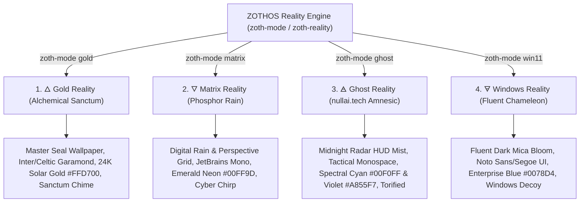
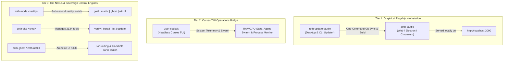

# 🜂 ZOTHOS Linux 🜄
### *The Sovereign Alchemical Intelligence & Offensive Security Operating System*
> *"As above, so below; as code, so mind."*

```text
       ▲             ZOTHOS Linux 1.0 (Azoth Sovereign Transmutation)
      ▲ ▲            -------------------------------------------------
     ▲   ▲           Desktop Core:     KDE Plasma 6 (24K Hermetic Gold & Obsidian)
    ▲  ☉  ▲          Base Runtime:     Debian 13 (Trixie) + Kali Rolling + Parrot OS Dual APT Pinning
   ▲   |   ▲         Kernel:           Linux 6.12+ Hardened AMD64
  ▲ 🜂  ☿  🜄 ▲        Offensive Stack:  213+ Verified Security, AD & Cloud Pentesting Tools
 ▲             ▲       Frontier AI:      Nous Hermes + NullAI HexStrike + Ollama + ComfyUI + AGY SDK
▲═══════🜁═══════▲      Stealth Engine:   nullai.tech Ghostmode [Amnesic Tor & Ephemeral RAM Wipe]
  \   🜃     /        Undercover Guise: Windows 11 Fluent Chameleon [Sub-Second Switch]
   \   |   /         Audio Engine:     Zoth Hermetic Audio Studio (Preloaded Lossless Classical Deck)
    \  🝘  /          Installer:        Calamares 24K Gold Sovereign Graphical Installer
     \   /           Architecture:     x86_64 Hybrid UEFI / BIOS Live ISO
      ▼
```

---

## ✦ System Manifesto & Vision

**ZOTHOS** is a sovereign Linux distribution engineered at the nexus of esoteric aesthetics, military-grade operational security, frontier agentic artificial intelligence, and offensive security parity.

1. **24K Hermetic Gold on Obsidian Glass**: Tailored KDE Plasma 6 desktop featuring pure circular gold medallions (`Zoth-Hermetic`), custom golden cursor trails, translucent gold drag-selection boxes, and a minimalist Celtic typography wallpaper.
2. **Offensive Security Parity (Kali + Parrot)**: Tri-repository architecture leveraging Debian Trixie stability with pinned Kali Rolling and Parrot Security repositories. Over **213+ verified tools** pre-configured for Active Directory exploitation, web auditing, binary reverse engineering, wireless warfare, and credential extraction.
3. **Ghostmode (nullai.tech influence)**: Military-grade amnesic operational security, automatic MAC address randomization, transparent Tor traffic routing, randomized machine hostname, and ephemeral RAM cache scrubbing on lock/shutdown.
4. **Incognito Chameleon (Windows 11 Cloak)**: Sub-second desktop transformation into a Windows 11 Enterprise environment (taskbar layout, Fluent GTK theme, Segoe typography, decoy PowerShell shell, decoy enterprise icons) for physical operational security in hostile or corporate environments.
5. **Frontier & Autonomous AI Forge**: Sovereign local inference engines (Ollama, vLLM, llama.cpp, ComfyUI) fused with underground AI red-teaming harnesses (Garak, PyRIT, Promptfoo, inspect_ai), multi-agent orchestrators (Nous Hermes, Google AGY SDK), and autonomous terminals ([NullAI HexStrike](https://github.com/NullAITech/NullAI-HexStrike-AI-Terminal)).
6. **Zoth Hermetic Audio Studio**: Dedicated desktop audio deck preloaded with classical focus and alchemical compositions (Satie, Chopin, Debussy, Bach) with a real-time Web Audio API spectrum visualizer.

---

## ✦ The Four Operating Realities (Sub-Second Reality Switcher)

ZOTHOS allows instant switching between four distinct operating realities with no logout or reboot required:


```mermaid
flowchart TD
    A["ZOTHOS Reality Engine (zoth-mode / zoth-reality)"] -->|zoth-mode gold| B["1. 🜂 Gold Reality (Alchemical Sanctum)"]
    A -->|zoth-mode matrix| C["2. 🜄 Matrix Reality (Phosphor Rain)"]
    A -->|zoth-mode ghost| D["3. 🜁 Ghost Reality (nullai.tech Amnesic)"]
    A -->|zoth-mode win11| E["4. 🜃 Windows Reality (Fluent Chameleon)"]
    
    B --> F["Master Seal Wallpaper, Inter/Celtic Garamond, 24K Solar Gold #FFD700, Sanctum Chime"]
    C --> G["Digital Rain & Perspective Grid, JetBrains Mono, Emerald Neon #00FF9D, Cyber Chirp"]
    D --> H["Midnight Radar HUD Mist, Tactical Monospace, Spectral Cyan #00F0FF & Violet #A855F7, Torified"]
    E --> I["Fluent Dark Mica Bloom, Noto Sans/Segoe UI, Enterprise Blue #0078D4, Windows Decoy"]
```

| Reality | CLI Command | Wallpaper Asset | Font & Color Accents | Operational Invariants |
| :--- | :--- | :--- | :--- | :--- |
| **1. Gold (Alchemical Sanctum)** | `zoth-mode gold` | `zoth-gold-master.jpg` | Inter / Celtic Garamond<br/>Solar Gold `#FFD700`, Dark Obsidian `#080A0E` | Default sovereign workspace, full tool access, Fastfetch hermetic seal status, `gold-sanctum.wav` audio cue |
| **2. Matrix (Phosphor Rain)** | `zoth-mode matrix` | `hermetic-matrix.png` | JetBrains Mono (Hacker Mono)<br/>Phosphor Emerald `#00FF9D`, Void Panels `#020603` | Cyberpunk terminal workstation, active digital rain, low-latency development, `matrix-chirp.wav` audio cue |
| **3. Ghost (Amnesic Stealth)** | `zoth-mode ghost` | `ghostmode-nullai.png` | JetBrains Mono / Slate<br/>Spectral Cyan `#00F0FF` & Violet `#A855F7` | Transparent Tor network routing, MAC randomization, machine hostname cloaking, RAM cache drop, `ghost-vapor.wav` audio cue |
| **4. Windows (Fluent Chameleon)** | `zoth-mode win11` | `win11-bloom.jpg` | Noto Sans / Segoe UI<br/>Windows Blue `#0078D4`, Dark Mica `#202020` | Windows 11 Fluent layout, decoy PowerShell profile, enterprise corporate disguise for physical OPSEC, `win11-fluent.wav` audio cue |

---

## ✦ Built-in Tools & Applications

### 1. Active Directory & Enterprise Red Team (Bake-in Default)
- **`certipy` / `certipy-ad`**: Active Directory Certificate Services (AD CS) enumeration and abuse tool (ESC1–ESC13).
- **`kerbrute`**: Fast Kerberos pre-auth brute-forcing, user enumeration, and TGT harvesting written in Go.
- **`coercer`**: Automatic Windows RPC authentication coercer (MS-RPRN, MS-EFSR, MS-DFSNM).
- **`peass` (`linPEAS` & `winPEAS`)**: Privilege Escalation Awesome Scripts Suite preloaded in `/usr/bin/linpeas` and `/usr/share/peass/`.
- **`bloodhound` & `neo4j`**: Visual Active Directory domain attack path analysis.
- **`impacket-scripts` & `responder`**: Complete NTLM relaying, SMB capture, and RPC protocol manipulation.
- **`evil-winrm` & `netexec`**: Modern Windows remote execution and post-exploitation.

### 2. Next-Gen Web Recon & Attack Surface
- **`httpx`**: ProjectDiscovery multi-purpose HTTP probe toolkit (resolutions, ports, TLS, status, technology detection).
- **`subfinder`**: Fast passive subdomain discovery aggregating 40+ OSINT sources.
- **`katana`**: Next-generation crawler and spidering framework with headless browser parsing.
- **`gowitness`**: Automated web screenshotting utility via headless Chromium for rapid visual triage.
- **`trufflehog`**: High-entropy secret and private key scanner with live key verification across repos and filesystems.
- **`caido`**: Modern, fast Rust-based intercepting proxy and web security suite.
- **`burpsuite` & `zaproxy`**: Industry standard web vulnerability inspection suites.
- **`sqlmap`, `ffuf`, `feroxbuster`, `nikto`, `commix`**: High-speed fuzzers and injection audit tools.

### 3. Sovereign Privacy, Encryption & OPSEC
- **`keepassxc`**: Secure offline password and credential vault with YubiKey / hardware key support. Desktop entry: `Zoth KeePassXC Vault`.
- **`veracrypt`**: Plausibly deniable multi-platform disk and file container encryption with hidden volumes. Desktop entry: `Zoth VeraCrypt Vault`.
- **`onionshare`**: Anonymous peer-to-peer file sharing, private chat, and ephemeral site hosting over Tor. Desktop entry: `Zoth OnionShare Privacy`.
- **`age`**: Modern, simple file encryption tool with UNIX philosophy.
- **`bleachbit`**: Deep system cache, memory, and browser artifact scrubber.
- **`tor` & `torsocks`**: Sovereign onion network routing for all terminal applications.
- **`macchanger` & `firejail`**: Hardware identity cloaking and application sandboxing.

### 4. Frontier AI & Autonomous Agent Forge
- **[Zoth Studio v2](https://github.com/NullAITech/zoth-studio-v2)** (`/opt/zoth-studio`): Zero-egress sovereign agent development studio and visual command suite. Built with Vite + React + Tailwind + Framer Motion, serving locally on `http://localhost:3000` (or launched in an Electron / Chromium app container). Features Lucy Netrunner Oracle with biomorphic STDP synaptic memory, 21-agent Byzantine consensus swarm orchestration, autonomous coding harnesses, and the 24K Hermetic UI.
- **One-Command Studio Updater (`zoth-update-studio`)**: Sovereign utility to keep Zoth Studio synchronized with upstream main in real-time. Automatically cleans dangling symlinks, pulls updates from Git, installs dependencies, and rebuilds with Vite in one seamless execution. Can also be invoked directly from the desktop launcher, Kickoff menu, or via `zoth-studio --update`.
- **[NullAI HexStrike AI Terminal](https://github.com/NullAITech/NullAI-HexStrike-AI-Terminal)**: Sovereign cybersecurity workstation with neural MITRE ATT&CK mapping, async FastAPI core, and retro CRT shader UI.
- **`hermes`**: [Nous Research Hermes Agent](https://github.com/NousResearch/Hermes-Agent) autonomous agent and skill ecosystem.
- **`ollama` & `vllm`**: High-throughput local LLM execution on CPU and NVIDIA/AMD GPUs.
- **`comfyui`**: Visual node-based workflow for Stable Diffusion, FLUX, and latent image generation.
- **`garak` & `pyrit`**: Generative AI red-teaming, prompt injection, and jailbreak security auditing.
- **`promptfoo` & `inspect_ai`**: Automated LLM evaluation and safety compliance suites.
- **`claude`, `codex`, `grok`, `opencode`**: Unified terminal interfaces to frontier coding and reasoning models.

### 5. Media Creation, Audio & Modern TUIs
- **`zoth-music`**: Zoth Hermetic Audio Studio with real-time spectrum visualizer, rotating 24K gold medallion, and preloaded classical focus compositions.
- **`maya`**: Maya Linux Video Studio Pro with 3D device mockups (iPhone 17 Pro, MacBooks), screen recording, and kinetic subtitles.
- **`lazydocker` & `lazygit`**: Interactive terminal dashboards for container and Git management.
- **`yazi`**: Blazing fast async terminal file manager written in Rust with inline image preview support.
- **`glow`**: Terminal markdown reader and documentation browser by Charm.
- **`doggo`**: Interactive, modern DNS client with JSON output and DoH/DoT support.
- **`trippy` (`trip`)**: Real-time network diagnostic combining traceroute and ping in a reactive TUI.

---

## ✦ Applications Menu Architecture

The Kickoff application launcher is cleanly structured into operational categories:

* **Pentesting & Red Team**:
  * `01 - Reconnaissance & OSINT` (Nmap, Amass, Subfinder, HTTPX, theHarvester, GoWitness)
  * `02 - Vulnerability Analysis` (Nuclei, Nikto, TruffleHog, Garak, PyRIT)
  * `03 - Web Application Auditing` (Caido, Burp Suite, ZAP, FFUF, SQLMap, Katana)
  * `04 - Exploitation & Red Team` (Certipy, Kerbrute, Coercer, PEASS, Metasploit, Sliver)
  * `05 - Sniffing & Traffic Interception` (Wireshark, Tshark, Bettercap, Responder, Mitmproxy)
  * `06 - Reverse Engineering & Forensics` (Ghidra, Radare2, Rizin, GDB, Binwalk)
* **Beta / Experimental**:
  * In-flight tools and bleeding-edge autonomous frameworks.
* **Miscellaneous**:
  * Visual effects, Matrix digital rain screensavers, audio decks, and sovereign pets.

---

## ✦ Operational Command Hierarchy

ZOTHOS enforces a three-tier command architecture designed for graphical workstations, headless servers, and rapid terminal execution:


```mermaid
flowchart TD
    subgraph Tier1["Tier 1: Graphical Flagship Workstation"]
        A["zoth-studio<br/>(Web / Electron / Chromium)"] -->|Served locally on| B["http://localhost:3000"]
        C["zoth-update-studio<br/>(Desktop & CLI Updater)"] -->|One-Command Git Sync & Build| A
    end

    subgraph Tier2["Tier 2: Curses TUI Operations Bridge"]
        D["zoth-cockpit<br/>(Headless Curses TUI)"] -->|System Telemetry & Swarm| E["RAM/CPU Stats, Agent Swarm & Process Monitor"]
    end

    subgraph Tier3["Tier 3: CLI Nexus & Sovereign Control Engines"]
        F["zoth-mode &lt;reality&gt;"] -->|Sub-second reality switch| G["gold | matrix | ghost | win11"]
        H["zoth-pkg &lt;cmd&gt;"] -->|Manages 213+ tools| I["verify | install | list | update"]
        J["zoth-ghost / zoth-netkill"] -->|Amnesic OPSEC| K["Tor routing & blackhole panic switch"]
    end
```

### 1. Zoth Studio v2 & One-Command Updater
The flagship visual environment for autonomous agents, WebGPU utilities, and multi-agent coordination:
```bash
# Launch Zoth Studio (automatically opens browser or app container at http://localhost:3000)
zoth-studio

# Launch headless daemon mode
zoth-studio --daemon

# Check for upstream updates from Git repository
zoth-update-studio --check

# Synchronize upstream, install dependencies, and run Vite production build
zoth-update-studio

# Force clean re-clone and full rebuild
zoth-update-studio --force

# Or via zoth-studio / zoth-pkg directly:
zoth-studio --update
zoth-pkg update studio
```

### 2. Reality Switcher (`zoth-mode`)
Instantly switch the operational reality of the desktop without closing running tools or restarting the session:
```bash
zoth-mode gold     # 24K Alchemical Gold, Celtic wallpaper, sanctum chime
zoth-mode matrix   # Phosphor Emerald, digital rain, hacker mono font
zoth-mode ghost    # Amnesic Tor routing, MAC cloak, ephemeral memory scrub
zoth-mode win11    # Windows 11 Fluent decoy, enterprise corporate camouflage
```

### 3. The 25 Sovereign Tools & 5 Cadres
Rather than cluttering the desktop with non-functional shortcuts or superficial toys, ZOTHOS curates a battle-tested core of **25 Sovereign Tools across 5 strategic Cadres** (backed by the full 213+ Kali/Parrot package repository):

| Cadre | Domain | Sovereign Tools | Key Commands |
| :--- | :--- | :--- | :--- |
| **Cadre I** | **Frontier AI & Autonomous Synthesis** | Nous Hermes, NullAI HexStrike, Claude Code, OpenCode, Codex CLI, Ollama, ComfyUI | `hermes`, `hexstrike`, `claude`, `opencode`, `codex`, `ollama` |
| **Cadre II** | **Active Directory & Enterprise Red Team** | Certipy, Kerbrute, Coercer, PEASS (linPEAS/winPEAS), BloodHound, Impacket | `certipy`, `kerbrute`, `coercer`, `linpeas`, `bloodhound` |
| **Cadre III** | **Attack Surface & Web Recon** | Subfinder, HTTPX, Katana, Nuclei, TruffleHog, GoWitness, Caido | `subfinder`, `httpx`, `katana`, `nuclei`, `trufflehog`, `gowitness`, `caido` |
| **Cadre IV** | **Sovereign OPSEC & Cryptographic Defense** | Ghostmode Tor, KeePassXC, VeraCrypt, OnionShare, age, NetKill Panic | `zoth-ghost`, `keepassxc`, `veracrypt`, `onionshare`, `age`, `zoth-netkill` |
| **Cadre V** | **Media, Audio & Terminal Mastery** | Zoth Studio v2, Zoth Hermetic Audio Studio, Maya Video Studio, LazyGit / LazyDocker, Yazi, Doggo, Trippy | `zoth-studio`, `zoth-music`, `maya`, `lazygit`, `lazydocker`, `yazi`, `trip` |

*For complete usage references, see [`ZOTHOS_TOOLS_CATALOG.md`](file:///home/neo/zothos/ZOTHOS_TOOLS_CATALOG.md) and [`docs/TOOLS_GUIDE.md`](file:///home/neo/zothos/docs/TOOLS_GUIDE.md).*

---

## ✦ System Architecture & Repository Layout

```text
/
├── config/
│   ├── includes.chroot/                    # Root filesystem overlay for live image
│   │   ├── etc/
│   │   │   ├── apt/
│   │   │   │   ├── preferences.d/
│   │   │   │   │   └── zothos-pinning.pref # Smart Debian 13 + Kali + Parrot dual APT pinning
│   │   │   │   └── sources.list.d/
│   │   │   │       ├── kali.list           # Kali Rolling tool repository
│   │   │   │       ├── parrot.list         # Parrot Security repository
│   │   │   │       └── zothos.list         # Debian Trixie base
│   │   │   ├── skel/                       # Default skeleton user profile (neo)
│   │   │   │   ├── .config/kdeglobals      # KDE Plasma 6 24K gold theme & selection accents
│   │   │   │   └── Desktop/                # Clean 24K gold medallion desktop shortcuts
│   │   │   └── xdg/menus/                  # Custom Kickoff application menus
│   │   ├── opt/                            # Standalone desktop apps & agent frameworks
│   │   │   ├── hexstrike-app/              # NullAI HexStrike AI Terminal
│   │   │   ├── zoth-studio/                # Zoth Studio v2 flagship agent workstation
│   │   │   ├── zoth-music-app/             # Zoth Hermetic Audio Studio
│   │   │   └── zoth-docs/                  # Sovereign Documentation Hub
│   │   └── usr/
│   │       ├── local/bin/                  # Master Zoth CLI tools & wrappers
│   │       │   ├── zoth-studio             # Flagship visual development suite launcher
│   │       │   ├── zoth-update-studio      # Studio one-command Git sync & Vite rebuilder
│   │       │   ├── zoth-cockpit            # Curses-based headless operational bridge
│   │       │   ├── zoth-pkg                # Sovereign package provisioner (213+ tools)
│   │       │   ├── zoth-tool-nexus         # Interactive 213+ tool manager
│   │       │   ├── zoth-mode               # Plasma 6 Reality Switcher (gold|matrix|ghost|win11)
│   │       │   ├── zoth-music              # Audio Studio launcher
│   │       │   ├── zoth-ghost              # Anti-forensics & Tor transparent routing
│   │       │   └── zoth-netkill            # Emergency network killswitch
│   │       └── share/icons/Zoth-Hermetic/  # Custom 24K Gold Medallion Icon Theme
│   └── package-lists/                      # Manifests for Debian live-build
│       ├── 00-core.list.chroot             # Base Linux 6.x kernel & systemd
│       ├── 10-dev.list.chroot              # Compilers (Rust, Go, Clang, Python, Node)
│       ├── 20-desktop.list.chroot          # KDE Plasma 6 environment
│       ├── 30-opsec.list.chroot            # Privacy, encryption & anonymity tools
│       └── 40-security.list.chroot         # Offensive security & red team arsenal
├── build/
│   ├── pack-iso.sh                         # Fast hybrid ISO packaging script (squashfs + xorriso)
│   └── build-iso.sh                        # Full clean chroot live-build pipeline
└── docs/                                   # Architectural specifications & guides
```

---

## ✦ How to Build the ISO

### Prerequisites
- Host running Debian 12/13, Parrot OS, Ubuntu 24+, or Kali Linux.
- Minimum 35 GB free disk space and root (`sudo`) access.
- Build tools: `live-build`, `squashfs-tools`, `xorriso`, `qemu-system-x86`, `libvirt-clients`, `libvirt-daemon-system`.

### Fast Incremental Build (`pack-iso.sh`)
When iterating on desktop configurations, icons, CLI wrappers, or preloaded applications in `config/includes.chroot/`:
```bash
cd /path/to/zothos
# Synchronizes config/includes.chroot into workspace, rebuilds squashfs, and packages hybrid ISO
sudo bash build/pack-iso.sh
```
This generates the bootable hybrid UEFI/BIOS image at:
[`build/zothos-1.0-amd64.iso`](file:///home/neo/zothos/build/zothos-1.0-amd64.iso) (~12 GB).

### Full Clean Rebuild from Scratch (`build-iso.sh`)
To perform a complete clean build bootstrapping Debian Trixie with APT pinning:
```bash
cd /path/to/zothos
sudo bash build/build-iso.sh
```

### Running and Testing in KVM / QEMU
Launch the verified test VM attached to the hypervisor:
```bash
# Attach graphical console via virt-manager:
virt-manager --connect qemu:///system --show-domain-console zothos-iso-live

# Or boot directly with raw QEMU:
qemu-system-x86_64 -enable-kvm -m 8G -smp 4 \
    -cdrom build/zothos-1.0-amd64.iso -boot d \
    -vga virtio -display gtk,gl=on
```

---

## ✦ Default Credentials & Live Session

* **Live User**: `neo`
* **Password**: `zoth` (or passwordless `sudo` in live session)
* **Root Password**: `toor`
* **Default Shell**: `bash` with Zoth Hermetic theme & Starship prompt
* **Emergency Panic Keys**:
  * `zoth-quicklock`: Instant session lock, RAM cache flush, and history shred
  * `zoth-netkill`: Emergency drop of all network interfaces and iptables BLACKHOLE

---

## ✦ License & Credits

* Engineered and curated by **[NullAI Tech](https://github.com/NullAITech)** and contributors.
* Powered by Debian GNU/Linux, KDE Plasma, Kali Linux, and Parrot Security.
* All trademarks and open-source tool copyrights belong to their respective creators.
