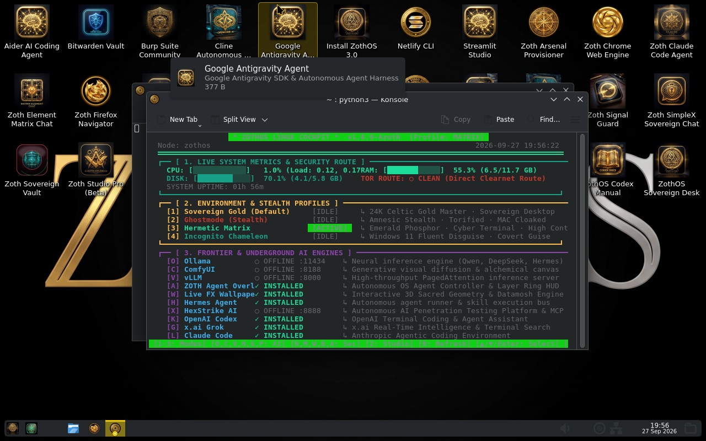
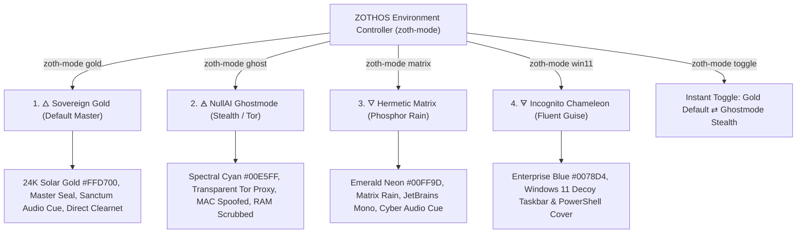

# 🜂 ZOTHOS Linux 🜄
### *The Sovereign Alchemical Intelligence, Cryptographic Vault & Offensive Security Operating System*
> *"As above, so below; as code, so mind."*

```text
       ▲             ZOTHOS Linux 3.0 (Azoth Sovereign Master)
      ▲ ▲            -------------------------------------------------
     ▲   ▲           Desktop Core:     KDE Plasma 6.3 Wayland (24K Celtic Gold & Obsidian Glass)
    ▲  ☉  ▲          Base Runtime:     Debian 13 (Trixie) + Kali Rolling + Parrot OS Triple APT Pinning
   ▲   |   ▲         Kernel:           Linux 6.12+ Hardened AMD64
  ▲ 🜂  ☿  🜄 ▲        Sovereign Vault:  Rust ChaCha20-Poly1305 + Argon2id Memory Process Injector (:8787)
 ▲             ▲       Frontier AI:      Aider AI + Google Antigravity + Claude Code + Cline + Ollama
▲═══════🜁═══════▲      Cloud Dev:        Netlify CLI Workstation + Streamlit Studio + Node v26 + Python 3.12
  \   🜃     /        Stealth & Privacy:Preloaded Tor Browser + NullAI Ghostmode [Amnesic Tor & MAC Wipe]
   \   |   /         Security Stack:   215+ Verified Tools (Burp Suite Gold, Caido, Metasploit, Nmap)
    \  🝘  /          Installer:        Calamares 24K Gold Sovereign Graphical System Installer
     \   /           Architecture:     x86_64 Hybrid UEFI / BIOS Live Bootable ISO
      ▼
```

[](https://opensource.org/licenses/MIT)
[](https://www.debian.org)
[](https://kde.org/plasma-desktop/)
[](https://nullai.tech)
[](https://nullai.tech)

---

## ✦ Visual Gallery & System Tour

### 1. Sovereign 24K Celtic Gold Master Desktop
The flagship KDE Plasma 6.3 Wayland experience: 24K Celtic Gold icons, alchemical typography, translucent frosted obsidian taskbar, and responsive desktop shortcuts for the complete sovereign workstation suite.


---

### 2. Applications Kickoff Menu (Celtic Gold Suite)
Every application category in the Kickoff menu features high-fidelity, hand-crafted 24K gold insignia (Development, Education, Graphics, Pentesting, System, Multimedia, Internet, Power actions).


---

### 3. Zoth Sovereign Vault (`zoth-vault`)
Zero-leak cryptographic secrets engine powered by Rust, Argon2id, and authenticated ChaCha20-Poly1305. Features multi-vault management supporting **Zoth Sovereign Vault**, **Bitwarden CLI (`bw`)**, **KeePassXC**, and **UNIX Pass (GPG)** with memory-only child process injection.


---

### 4. Aider AI Coding Agent Workstation (`aider`)
Dedicated pair programming terminal environment with telemetry, offline Ollama integration (100% private coding without external internet), Architect dual-reasoning mode, and automated git commits.


---

### 5. Netlify CLI Serverless & Edge Workstation (`zoth-netlify`)
Dedicated interactive terminal operations deck for Netlify: site linking, local server emulation (`netlify dev`), edge functions, environment variable synchronization, and one-command production deployments.


---

### 6. Streamlit Studio & ML Dashboard Station (`zoth-streamlit`)
Isolated Python 3.12 environment with pre-bundled data science, machine learning, and cyber intelligence dashboards with live local server management on `http://localhost:8501`.


---

### 7. Zoth Tor Privacy Browser (`tor-browser`)
Pre-bundled standalone Tor Browser located in `/opt/tor-browser/` with multi-hop onion routing, automated circuit isolation, and zero third-party tracking.


---

### 8. Burp Suite Community Edition & Offensive Security
Preloaded industry-standard web intercepting proxy with custom Celtic Gold icon branding, alongside Caido, Nmap, Wireshark, Metasploit Framework, and Aircrack-ng.


---

### 9. ZothOS Cockpit Operations Center (`zoth-cockpit`)
Full-screen curses-based system operations dashboard featuring live CPU/RAM/Disk telemetry, active environment/stealth switcher, AI daemon status, and instant tool launcher.



---

### 10. In-House Codex Manual & Documentation (`zoth-docs`)
Comprehensive offline documentation codex preloaded directly inside the operating system, detailing architectural invariants, tool guides, security best practices, and CLI cheatsheets.


---

## ✦ System Manifesto & Vision

**ZOTHOS** is a sovereign Linux distribution engineered at the nexus of esoteric aesthetics, military-grade operational security, frontier agentic artificial intelligence, and offensive security parity.

1. **24K Hermetic Gold on Obsidian Glass**: Tailored KDE Plasma 6.3 desktop featuring pure circular gold medallions (`Zoth-Hermetic`), custom golden cursor trails, translucent gold drag-selection boxes, and a minimalist Celtic typography wallpaper.
2. **Cryptographic Sovereignty (Zoth Vault)**: Native local Rust daemon on `127.0.0.1:8787` using Argon2id key derivation and ChaCha20-Poly1305 encryption. Command `zoth-vault run -- <cmd>` injects decrypted secrets directly into child process execution memory without ever writing them to disk.
3. **Offensive Security Parity (Kali + Parrot)**: Tri-repository architecture leveraging Debian Trixie stability with pinned Kali Rolling and Parrot Security repositories. Over **215+ verified tools** pre-configured for Active Directory exploitation, web auditing, binary reverse engineering, wireless warfare, and credential extraction.
4. **Environment Modes & Stealth Profiles**: Seamlessly switch between **Sovereign Gold Master (Default)**, **NullAI Ghostmode (Stealth / Torified / Amnesic)**, **Hermetic Matrix (Emerald Phosphor)**, and **Incognito Chameleon (Windows 11 Guise)** with sub-second response and zero session restart.
5. **Frontier & Autonomous AI Forge**: Sovereign local inference engines (Ollama, vLLM, llama.cpp, ComfyUI) fused with underground AI red-teaming harnesses (Garak, PyRIT, Promptfoo, inspect_ai), multi-agent orchestrators (Nous Hermes, Google AGY SDK), autonomous coding agents (Aider, Claude Code, Cline, OpenCode), and autonomous terminals ([NullAI HexStrike](https://github.com/NullAITech/NullAI-HexStrike-AI-Terminal)).
6. **Zoth Hermetic Audio Studio**: Dedicated desktop audio deck preloaded with classical focus and alchemical compositions (Satie, Chopin, Debussy, Bach) with a real-time Web Audio API spectrum visualizer.

---

## ✦ Environment & Stealth Profiles

ZOTHOS allows instant switching between operational states with zero logout or reboot required:


```mermaid
flowchart TD
    A["ZOTHOS Environment Controller (zoth-mode)"] -->|zoth-mode gold| B["1. 🜂 Sovereign Gold (Default Master)"]
    A -->|zoth-mode ghost| C["2. 🜁 NullAI Ghostmode (Stealth / Tor)"]
    A -->|zoth-mode matrix| D["3. 🜄 Hermetic Matrix (Phosphor Rain)"]
    A -->|zoth-mode win11| E["4. 🜃 Incognito Chameleon (Fluent Guise)"]
    A -->|zoth-mode toggle| F["Instant Toggle: Gold Default ⇄ Ghostmode Stealth"]
    
    B --> G["24K Solar Gold #FFD700, Master Seal, Sanctum Audio Cue, Direct Clearnet"]
    C --> H["Spectral Cyan #00E5FF, Transparent Tor Proxy, MAC Spoofed, RAM Scrubbed"]
    D --> I["Emerald Neon #00FF9D, Matrix Rain, JetBrains Mono, Cyber Audio Cue"]
    E --> J["Enterprise Blue #0078D4, Windows 11 Decoy Taskbar & PowerShell Cover"]
```

| Mode / Profile | CLI Command | Audio Cue | Network State | Operational Purpose |
| :--- | :--- | :--- | :--- | :--- |
| **Sovereign Gold (Default)** | `zoth-mode gold` | `gold-sanctum.wav` | Direct Clearnet | Master sovereign workstation, 24K gold aesthetic, full hardware performance. |
| **NullAI Ghostmode (Stealth)** | `zoth-mode ghost` | `ghost-vapor.wav` | Transparent Tor Proxy | Full anti-surveillance cloak, MAC address randomization, ephemeral hostname, RAM cache wipe. |
| **Hermetic Matrix** | `zoth-mode matrix` | `matrix-chirp.wav` | Direct Clearnet | Emerald phosphor monospace terminal environment for low-latency coding and audits. |
| **Incognito Chameleon** | `zoth-mode win11` | `win11-fluent.wav` | Direct Clearnet | Windows 11 Fluent decoy desktop for physical OPSEC in hostile corporate environments. |
| **Instant Toggle** | `zoth-mode toggle` | Contextual | Contextual | Flip back and forth between Default Gold and Ghostmode Stealth with a single keystroke. |

---

## ✦ Sovereign Cryptographic Vault Engine

The **Zoth Sovereign Vault** protects sensitive API keys, SSH credentials, private keys, and blockchain seeds.


```mermaid
sequenceDiagram
    autonumber
    actor Dev as Developer / Agent
    participant CLI as zoth-vault CLI
    participant Daemon as Rust Daemon (:8787)
    participant Disk as Encrypted Vault File
    participant Proc as Target Process (e.g. Aider)

    Dev->>CLI: zoth-vault run -- aider
    CLI->>Daemon: GET /v1/export/env (Bearer Token)
    Daemon->>Disk: Read & Decrypt with ChaCha20-Poly1305 Key
    Daemon-->>CLI: Decrypted Key-Value Map in RAM
    CLI->>Proc: Inject Environment Variables into Child Process Memory
    Note over Disk,Proc: Keys never touch the disk in decrypted state!
    Proc->>Dev: Interactive Process Runs with Valid API Keys
```

### Multi-Vault Commands
```bash
# Check daemon health, status, and unlock state
zoth-vault status

# Store a secret key under encrypted storage
zoth-vault set OPENAI_API_KEY "sk-..." --provider openai --tags "ai,prod"

# List all stored secrets (masked by default)
zoth-vault list

# Reveal a single secret with auto-scrubbing terminal buffer
zoth-vault get OPENAI_API_KEY

# Zero-disk secret execution (injects keys directly into process RAM)
zoth-vault run -- aider

# Multi-Vault Switcher (Zoth Vault, Bitwarden, KeePassXC, UNIX Pass)
zoth-vault
```

---

## ✦ Frontier AI & Coding Agent Workstations

ZOTHOS ships with an autonomous AI developer stack configured out-of-the-box:

| Coding Agent | Launcher Command | Offline Local Support | Key Capabilities |
| :--- | :--- | :--- | :--- |
| **Aider AI Coding Agent** | `aider` | Yes (Local Ollama) | Terminal pair programming, git auto-commit, Architect mode, multi-file edits. |
| **Google Antigravity Agent** | `antigravity` / `agy` | Yes (Ollama / Local APIs) | Agentic IDE with autonomous subagent spawning, skills, and browser control. |
| **Claude Code Agent** | `claude` | No (Cloud API) | Anthropic agentic coding CLI with full codebase refactoring capabilities. |
| **Cline Autonomous Agent** | `cline` | Yes (Local Ollama / OpenRouter) | Interactive agent with step-by-step task breakdown and MCP tool integration. |
| **Nous Hermes Agent** | `hermes` | Yes (Local Models) | Autonomous agent runner with 70+ built-in developer skills. |
| **OpenAI Codex CLI** | `codex` | No (Cloud API) | Fast terminal code generation and interactive diff patch assistant. |
| **x.ai Grok CLI** | `grok` | No (Cloud API) | Real-time terminal search, news verification, and OSINT analysis. |
| **Ollama Model Runtime** | `ollama serve` | 100% Offline | Resident local LLM engine running Qwen 2.5 Coder, Llama 3.2, and DeepSeek. |

---

## ✦ Built-in Tools & Applications

### 1. Active Directory & Enterprise Red Team
- **`certipy` / `certipy-ad`**: Active Directory Certificate Services (AD CS) enumeration and abuse tool (ESC1–ESC13).
- **`kerbrute`**: Fast Kerberos pre-auth brute-forcing, user enumeration, and TGT harvesting.
- **`coercer`**: Automatic Windows RPC authentication coercer (MS-RPRN, MS-EFSR, MS-DFSNM).
- **`peass` (`linPEAS` & `winPEAS`)**: Privilege Escalation Awesome Scripts Suite preloaded in `/usr/bin/linpeas` and `/usr/share/peass/`.
- **`bloodhound` & `neo4j`**: Visual Active Directory domain attack path analysis.
- **`impacket-scripts` & `responder`**: Complete NTLM relaying, SMB capture, and RPC protocol manipulation.
- **`evil-winrm` & `netexec`**: Modern Windows remote execution and post-exploitation.

### 2. Next-Gen Web Recon & Attack Surface
- **`httpx`**: ProjectDiscovery multi-purpose HTTP probe toolkit (resolutions, ports, TLS, status, technology detection).
- **`subfinder`**: Fast passive subdomain discovery aggregating 40+ OSINT sources.
- **`katana`**: Next-generation crawler and spidering framework with headless browser parsing.
- **`gowitness`**: Automated web screenshotting utility via headless Chromium for rapid visual triage.
- **`trufflehog`**: High-entropy secret and private key scanner with live key verification across repos and filesystems.
- **`caido`**: Modern, fast Rust-based intercepting proxy and web security suite.
- **`burpsuite` & `zaproxy`**: Industry-standard web vulnerability inspection suites.
- **`sqlmap`, `ffuf`, `feroxbuster`, `nikto`, `commix`**: High-speed fuzzers and injection audit tools.

### 3. Sovereign Privacy, Encryption & OPSEC
- **Tor Browser**: Official standalone bundle preloaded in `/opt/tor-browser/` with multi-hop onion routing.
- **NullAI Ghostmode (`zoth-ghost`)**: Transparent Tor routing (AnonSurf), MAC address randomization, and memory scrubbing.
- **`keepassxc`**: Secure offline password and credential vault with YubiKey / hardware key support.
- **`veracrypt`**: Plausibly deniable multi-platform disk and file container encryption with hidden volumes.
- **`onionshare`**: Anonymous peer-to-peer file sharing, private chat, and ephemeral site hosting over Tor.
- **`age`**: Modern, simple file encryption tool with UNIX philosophy.
- **`bleachbit`**: Deep system cache, memory, and browser artifact scrubber.
- **`zoth-netkill`**: Instant emergency hardware network killswitch.

---

## ✦ Installation & Live Boot

ZOTHOS is delivered as a bootable hybrid ISO compatible with UEFI and legacy BIOS systems.

### 1. Booting the Live ISO
Flash the ISO to a USB flash drive (minimum 16 GB recommended):
```bash
sudo dd if=zothos-3.0-amd64.iso of=/dev/sdX bs=4M status=progress conv=fsync
```

### 2. Live Credentials
- **Username:** `neo`
- **Password:** `zoth`
- **Root Password:** `zoth`
- **Sudo:** Full passwordless privileges for user `neo`

### 3. Permanent System Installation
Launch the 24K Gold Calamares graphical installer from the desktop icon or terminal:
```bash
launch-calamares
```
Features automated Btrfs subvolume layout, optional full-disk LUKS encryption, and systemd-boot / GRUB integration.

---

## ✦ Global Hotkeys & Cheatsheet

| Shortcut / Command | Context | Action |
| :--- | :--- | :--- |
| `Ctrl + Alt + T` | Global Desktop | Open Zoth Konsole terminal |
| `Super` | Global Desktop | Open Applications Kickoff menu |
| `Alt + F2` | Global Desktop | KRunner universal command prompt |
| `Super + D` | Global Desktop | Minimize / show desktop |
| `Super + L` | Global Desktop | QuickLock screen session lock |
| `zoth-mode toggle` | Terminal | Instant toggle between Sovereign Gold & Ghostmode Stealth |
| `zoth-vault` | Terminal | Sovereign Vault interactive manager |
| `zoth-cockpit` | Terminal | Full-screen curses operations dashboard |
| `zoth-fastfetch` | Terminal | Display alchemical system banner and telemetry |
| `zoth-netlify` | Terminal | Netlify CLI serverless operations workstation |
| `zoth-streamlit` | Terminal | Streamlit Studio data & ML application runner |
| `aider` | Terminal | Aider AI coding agent workstation |
| `tor-browser` | Terminal / GUI | Launch pre-bundled Tor Privacy Browser |
| `zoth-docs` | Terminal / GUI | Open in-house ZothOS Codex Manual |

---

## ✦ Architecture & Build System

ZOTHOS is built using a customized Debian Live Build framework with surgical repository overlay:
- `config/includes.chroot/`: In-tree root filesystem overlay for custom binaries, icon themes, Plasma configs, and systemd units.
- `config/package-lists/`: Layered package configurations across desktop, opsec, offensive security, and AI stacks.
- `build/pack-iso.sh`: High-density XZ SquashFS compressor and xorriso ISO packager.

---

## ✦ License & Attributions

- **ZOTHOS Linux**: Released under the [MIT License](LICENSE).
- **Core Engine & Architecture**: Engineered by **NullAI Tech** ([nullai.tech](https://nullai.tech)).
- **Upstream Foundations**: Debian GNU/Linux, KDE Plasma, Kali Linux, and Parrot Security OS.

*✦ Sovereign Mind. Sovereign Code. Sovereign Silicon. ✦*
