<div align="center">

  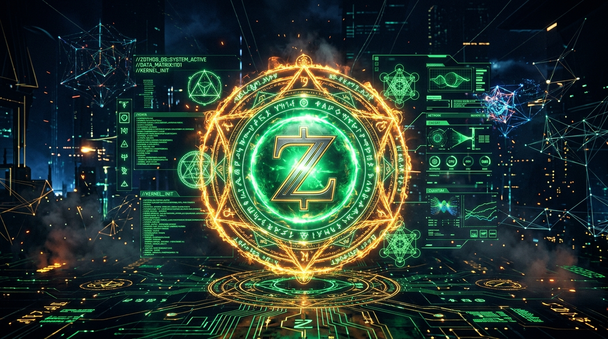

  <br />
  <br />

  <h1>🜂 &nbsp; Z O T H O S &nbsp; L I N U X &nbsp; 3 . 0 &nbsp; 🜄</h1>
  <h3><em>The Sovereign Alchemical Intelligence, Cryptographic Vault & Offensive Security Operating System</em></h3>

  <p>
    <strong>KDE Plasma 6.3 Wayland &bull; Debian 13 Trixie &bull; Kali Rolling &bull; Parrot OS &bull; Linux 6.12+ Hardened</strong>
  </p>

  <p>
    <em>"As above, so below; as code, so mind."</em>
  </p>

  <p>
    <a href="LICENSE"></a>
    <a href="SECURITY.md"></a>
    <a href="REPRODUCIBLE_BUILDS.md"></a>
    <a href="https://scorecard.dev/viewer/?repo=github.com/NullAITech/zoth-os"></a>
    <a href="https://github.com/NullAITech/zoth-os/actions/workflows/codeql.yml"></a>
    <a href="docs/OPENSSF_BEST_PRACTICES.md"></a>
    <a href="https://www.virustotal.com/gui/file/44ab8e7bf2e50e1096ebea16b258133ed57aecd910a6b2178c3f3f65736ba1fc"></a>
    <a href="https://www.debian.org"></a>
    <a href="https://kde.org/plasma-desktop/"></a>
    <a href="https://nullai.tech"></a>
    <a href="https://nullai.tech"></a>
    <a href="https://github.com/NullAITech/zoth-os"></a>
  </p>

  <br />

  <p>
    <a href="#-system-specifications-at-a-glance"><b>Specification</b></a> &bull;
    <a href="#-visual-gallery--system-tour"><b>Visual Tour</b></a> &bull;
    <a href="#-system-architecture"><b>Architecture</b></a> &bull;
    <a href="#-environment--stealth-profiles"><b>Stealth Profiles</b></a> &bull;
    <a href="#-sovereign-cryptographic-vault-engine"><b>Vault Engine</b></a> &bull;
    <a href="#-frontier-ai--coding-agent-workstations"><b>Frontier AI</b></a> &bull;
    <a href="#-built-in-tools--applications"><b>Tool Arsenal</b></a> &bull;
    <a href="#-installation--live-boot"><b>Installation</b></a>
  </p>

</div>

---

## ✦ System Specifications at a Glance

| Pillar | Technology | Implementation Details |
| :--- | :--- | :--- |
| **Desktop Core** | **KDE Plasma 6.3 Wayland** | Translucent obsidian frosted glass, 24K Celtic Gold insignia, KWin compositor effects, and custom golden cursor trails. |
| **System Base** | **Debian 13 (Trixie)** | Surgical tri-repository overlay with **Kali Rolling** and **Parrot OS Security** APT pinning for 100% package cohesion. |
| **Kernel Stack** | **Linux 6.12+ Hardened** | Low-latency desktop kernel with Intel UHD (`i915`) + NVIDIA Quadro hybrid graphics DRM auto-switching. |
| **Sovereign Vault** | **Rust ChaCha20-Poly1305** | Native resident daemon on `127.0.0.1:8787` using Argon2id key derivation; injects secrets directly into process RAM. |
| **Frontier AI Forge** | **Autonomous Agent Swarm** | Google Antigravity CLI, Aider AI, Cursor AI, Grok Bot, Claude Code, Cline, and Ollama offline LLM model runner. |
| **Cloud Workstations** | **Full-Stack Developer Deck** | Netlify CLI ops suite, Streamlit Studio ML dashboards, Node v26, Python 3.12, Rust, Go, Foundry, and Solana. |
| **Stealth & Privacy** | **NullAI Ghostmode** | One-touch Tor transparent routing, MAC address spoofing, ephemeral hostname generation, and RAM memory scrubbing. |
| **Security Arsenal** | **215+ Verified Tools** | Pre-configured suites for AD exploitation, web auditing, binary reverse engineering, wireless warfare, and credential extraction. |
| **Live Boot & Install** | **Calamares 24K Sovereign** | Hybrid UEFI & legacy BIOS bootloader with automatic GPT/Btrfs subvolume layout and optional LUKS disk encryption. |

---

## ✦ Visual Gallery & System Tour

<details open>
<summary><b>1. Sovereign 24K Celtic Gold Master Desktop</b></summary>
<br />

The flagship KDE Plasma 6.3 Wayland experience: 24K Celtic Gold icons, alchemical typography, translucent frosted obsidian taskbar, and responsive desktop shortcuts for the complete sovereign workstation suite.

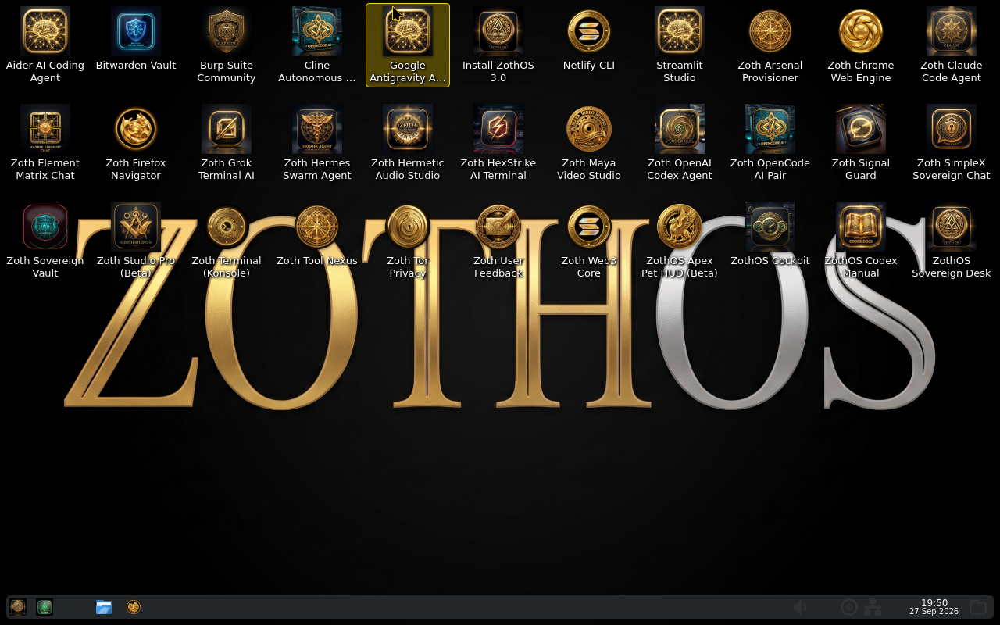

</details>

<details open>
<summary><b>2. Applications Kickoff Menu (Celtic Gold Suite)</b></summary>
<br />

Every application category in the Kickoff menu features high-fidelity, hand-crafted 24K gold insignia. Fully customized with spacious navigation tabs, smooth hover scaling, and clean power/leave action buttons.

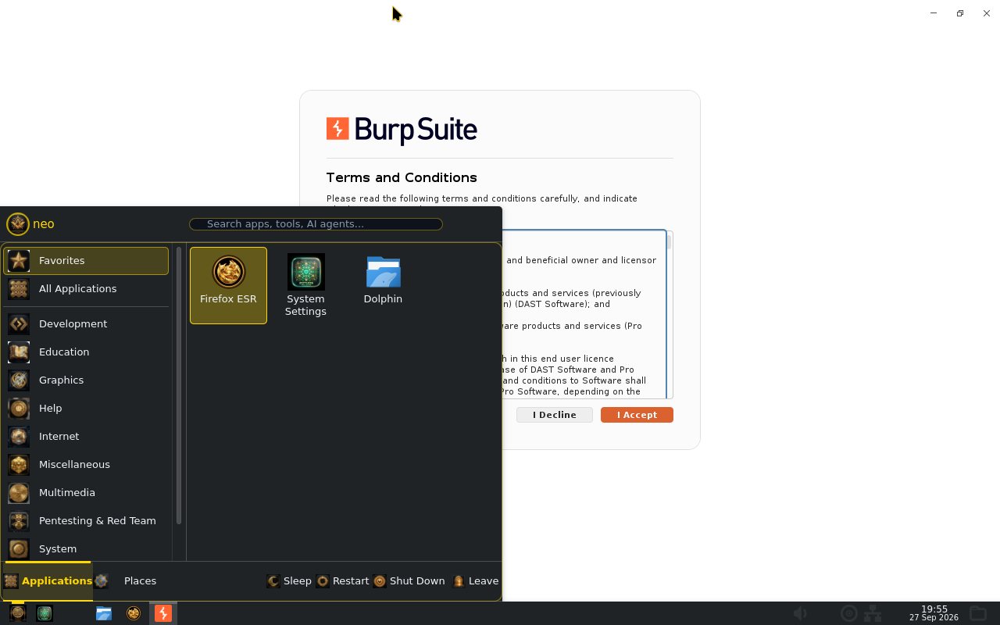

</details>

<details>
<summary><b>3. Zoth Sovereign Vault (<code>zoth-vault</code>)</b></summary>
<br />

Zero-leak cryptographic secrets engine powered by Rust, Argon2id, and authenticated ChaCha20-Poly1305. Features multi-vault management supporting **Zoth Sovereign Vault**, **Bitwarden CLI (`bw`)**, **KeePassXC**, and **UNIX Pass (GPG)** with memory-only child process injection.

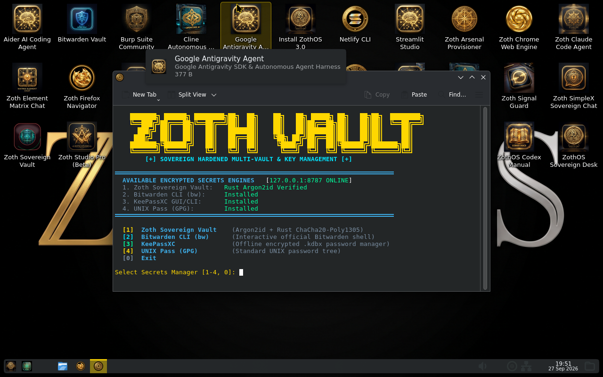

</details>

<details>
<summary><b>4. Aider AI Coding Agent Workstation (<code>aider</code>)</b></summary>
<br />

Dedicated pair programming terminal environment with telemetry, offline Ollama integration (100% private coding without external internet), Architect dual-reasoning mode, and automated git commits.

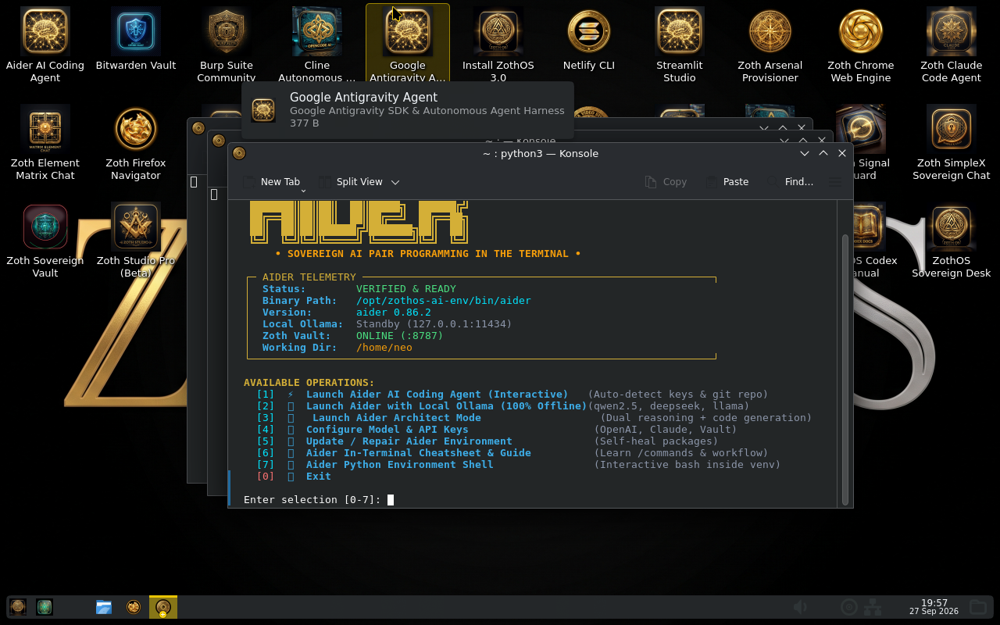

</details>

<details>
<summary><b>5. Netlify CLI Serverless & Edge Workstation (<code>zoth-netlify</code>)</b></summary>
<br />

Dedicated interactive terminal operations deck for Netlify: site linking, local server emulation (`netlify dev`), edge functions, environment variable synchronization, and one-command production deployments.

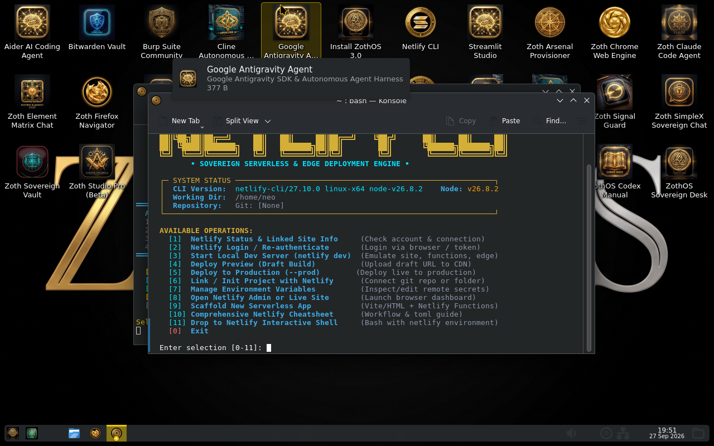

</details>

<details>
<summary><b>6. Streamlit Studio & ML Dashboard Station (<code>zoth-streamlit</code>)</b></summary>
<br />

Isolated Python 3.12 environment with pre-bundled data science, machine learning, and cyber intelligence dashboards with live local server management on `http://localhost:8501`.

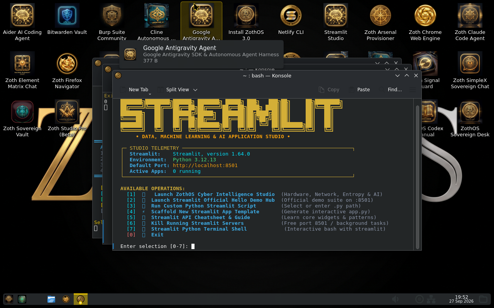

</details>

<details>
<summary><b>7. Zoth Tor Privacy Browser (<code>tor-browser</code>)</b></summary>
<br />

Pre-bundled standalone Tor Browser located in `/opt/tor-browser/` with multi-hop onion routing, automated circuit isolation, and zero third-party tracking.

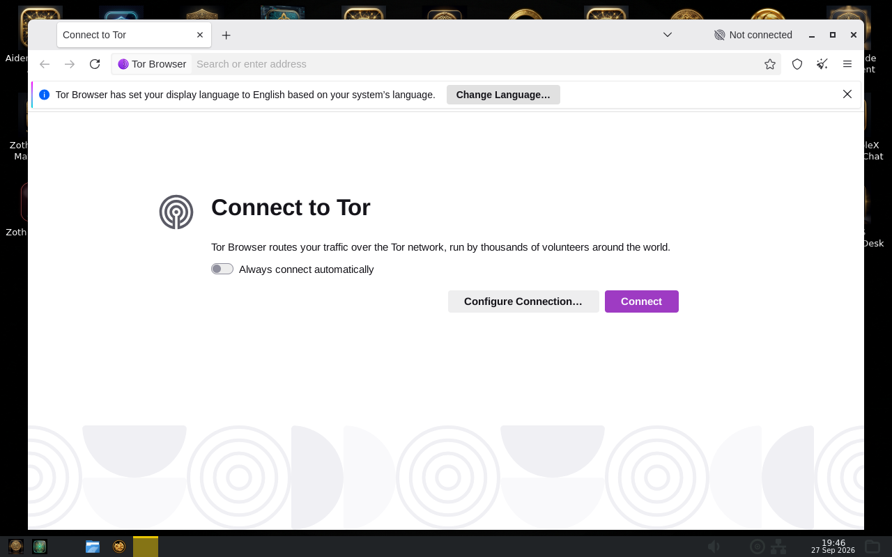

</details>

<details>
<summary><b>8. Burp Suite Community Edition & Offensive Security</b></summary>
<br />

Preloaded industry-standard web intercepting proxy with custom Celtic Gold icon branding, alongside Caido, Nmap, Wireshark, Metasploit Framework, and Aircrack-ng.

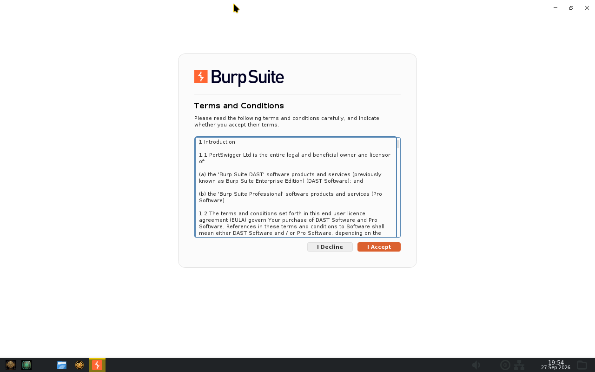

</details>

<details>
<summary><b>9. ZothOS Cockpit Pro Operations Center (<code>zoth-cockpit</code>)</b></summary>
<br />

Premier flagship Electron operations dashboard & curses TUI fallback (`--tui`, `--status`, `--json`) featuring live animated circular dials, 60s rolling waveform sparklines, global cursor tracker sync, real-time network RX/TX throughput, top active process inspector, the full 21-Agent Sovereign Pantheon deck with zero-egress dispatch, daemon supervisor with live loopback log viewer, and instant 5-profile Reality Mode switching.

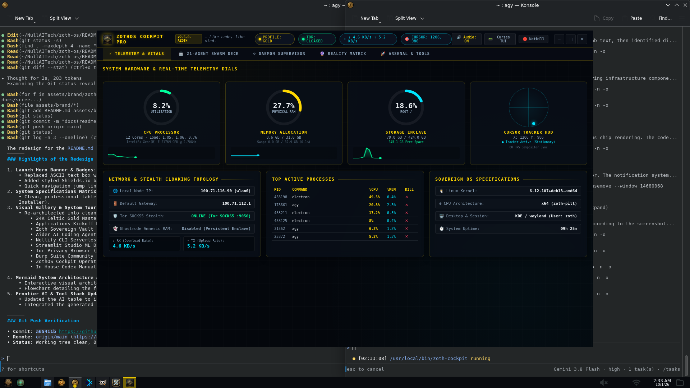

<div align="center">
  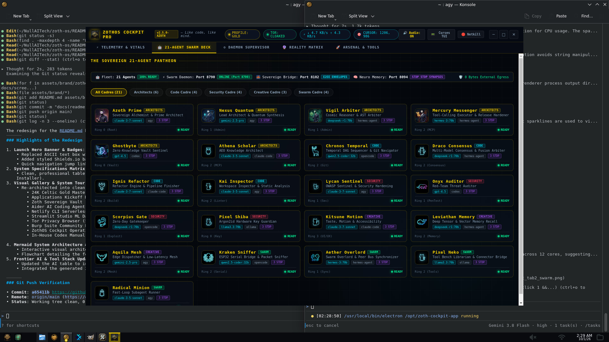
  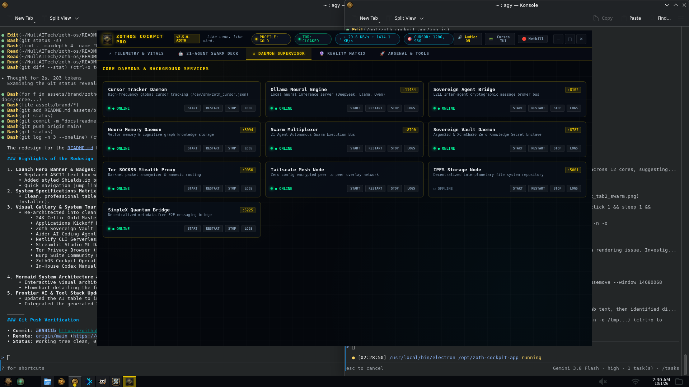
</div>

</details>

<details>
<summary><b>10. In-House Codex Manual & Documentation (<code>zoth-docs</code>)</b></summary>
<br />

Comprehensive offline documentation codex preloaded directly inside the operating system, detailing architectural invariants, tool guides, security best practices, and CLI cheatsheets.

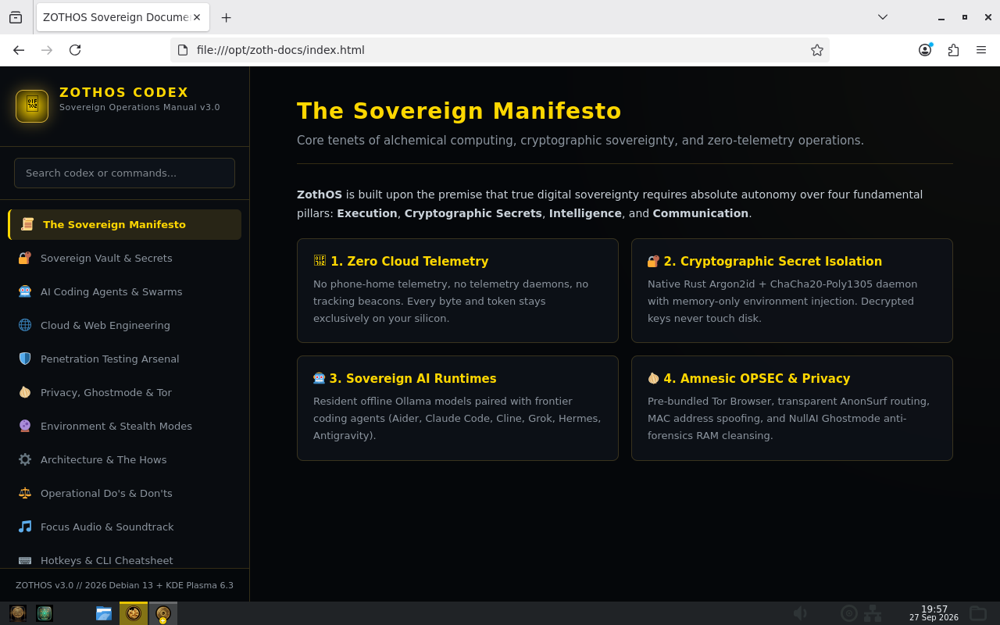

</details>

---

## ✦ System Architecture

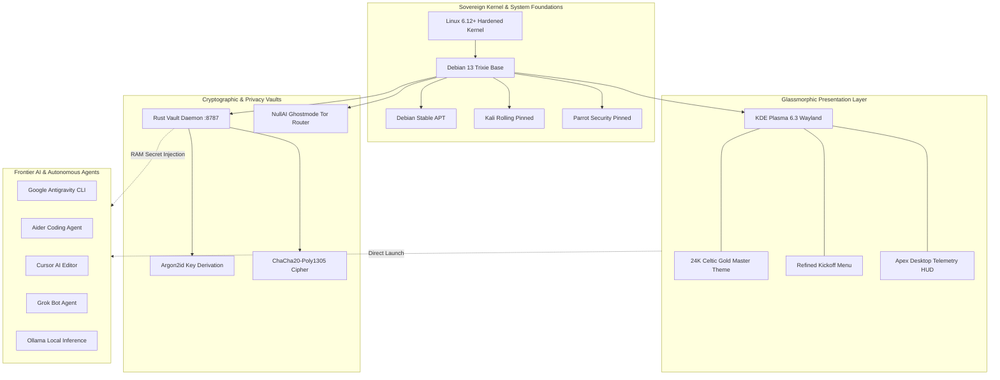
```mermaid
graph TB
    subgraph Core ["Sovereign Kernel & System Foundations"]
        K[Linux 6.12+ Hardened Kernel]
        D[Debian 13 Trixie Base]
        K --> D
        D --> APT1[Debian Stable APT]
        D --> APT2[Kali Rolling Pinned]
        D --> APT3[Parrot Security Pinned]
    end

    subgraph UI ["Glassmorphic Presentation Layer"]
        W[KDE Plasma 6.3 Wayland]
        TH[24K Celtic Gold Master Theme]
        KO[Refined Kickoff Menu]
        HUD[Apex Desktop Telemetry HUD]
        W --- TH
        W --- KO
        W --- HUD
    end

    subgraph Security ["Cryptographic & Privacy Vaults"]
        V[Rust Vault Daemon :8787]
        A2[Argon2id Key Derivation]
        C20[ChaCha20-Poly1305 Cipher]
        GM[NullAI Ghostmode Tor Router]
        V --> A2
        V --> C20
    end

    subgraph AI ["Frontier AI & Autonomous Agents"]
        AG[Google Antigravity CLI]
        AD[Aider Coding Agent]
        CR[Cursor AI Editor]
        GK[Grok Bot Agent]
        OL[Ollama Local Inference]
    end

    D --> W
    D --> V
    D --> GM
    V -.->|RAM Secret Injection| AI
    UI -.->|Direct Launch| AI
```

---

## ✦ Environment & Stealth Profiles

ZOTHOS allows instantaneous switching between operational states with zero logout or reboot required:

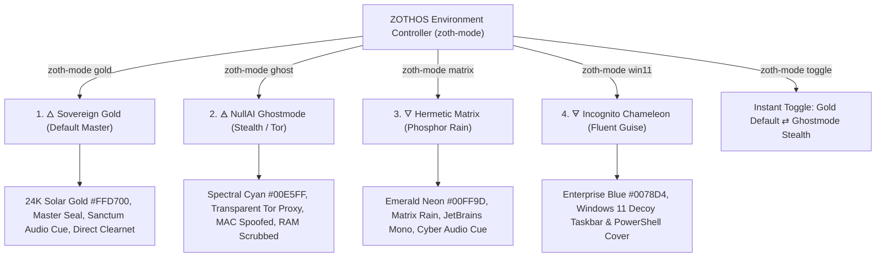
```mermaid
flowchart TD
    A["ZOTHOS Environment Controller (zoth-mode)"] -->|zoth-mode gold| B["1. 🜂 Sovereign Gold (Default Master)"]
    A -->|zoth-mode ghost| C["2. 🜁 NullAI Ghostmode (Stealth / Tor)"]
    A -->|zoth-mode matrix| D["3. 🜄 Hermetic Matrix (Phosphor Rain)"]
    A -->|zoth-mode win11| E["4. 🜃 Incognito Chameleon (Fluent Guise)"]
    A -->|zoth-mode toggle| F["Instant Toggle: Gold Default ⇄ Ghostmode Stealth"]
    
    B --> G["24K Solar Gold #FFD700, Master Seal, Sanctum Audio Cue, Direct Clearnet"]
    C --> H["Spectral Cyan #00E5FF, Transparent Tor Proxy, MAC Spoofed, RAM Scrubbed"]
    D --> I["Emerald Neon #00FF9D, Matrix Rain, JetBrains Mono, Cyber Audio Cue"]
    E --> J["Enterprise Blue #0078D4, Windows 11 Decoy Taskbar & PowerShell Cover"]
```

| Mode / Profile | CLI Command | Audio Cue | Network State | Operational Purpose |
| :--- | :--- | :--- | :--- | :--- |
| **Sovereign Gold (Default)** | `zoth-mode gold` | `gold-sanctum.wav` | Direct Clearnet | Master sovereign workstation, 24K gold aesthetic, full hardware performance. |
| **NullAI Ghostmode (Stealth)** | `zoth-mode ghost` | `ghost-vapor.wav` | Transparent Tor Proxy | Full anti-surveillance cloak, MAC address randomization, ephemeral hostname, RAM cache wipe. |
| **Hermetic Matrix** | `zoth-mode matrix` | `matrix-chirp.wav` | Direct Clearnet | Emerald phosphor monospace terminal environment for low-latency coding and audits. |
| **Incognito Chameleon** | `zoth-mode win11` | `win11-fluent.wav` | Direct Clearnet | Windows 11 Fluent decoy desktop for physical OPSEC in hostile corporate environments. |
| **Instant Toggle** | `zoth-mode toggle` | Contextual | Contextual | Flip back and forth between Default Gold and Ghostmode Stealth with a single keystroke. |

---

## ✦ Sovereign Cryptographic Vault Engine

The **Zoth Sovereign Vault** protects sensitive API keys, SSH credentials, private keys, and blockchain seeds. Decrypted secrets are injected directly into child process memory via RAM, ensuring zero secrets ever touch persistent disk storage.

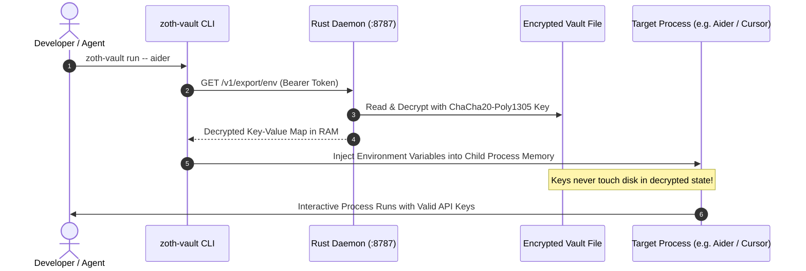
```mermaid
sequenceDiagram
    autonumber
    actor Dev as Developer / Agent
    participant CLI as zoth-vault CLI
    participant Daemon as Rust Daemon (:8787)
    participant Disk as Encrypted Vault File
    participant Proc as Target Process (e.g. Aider / Cursor)

    Dev->>CLI: zoth-vault run -- aider
    CLI->>Daemon: GET /v1/export/env (Bearer Token)
    Daemon->>Disk: Read & Decrypt with ChaCha20-Poly1305 Key
    Daemon-->>CLI: Decrypted Key-Value Map in RAM
    CLI->>Proc: Inject Environment Variables into Child Process Memory
    Note over Disk,Proc: Keys never touch disk in decrypted state!
    Proc->>Dev: Interactive Process Runs with Valid API Keys
```

### Multi-Vault CLI Commands
```bash
# Check daemon health, status, and unlock state
zoth-vault status

# Store a secret key under encrypted storage
zoth-vault set OPENAI_API_KEY "sk-..." --provider openai --tags "ai,prod"

# List all stored secrets (masked by default)
zoth-vault list

# Reveal a single secret with auto-scrubbing terminal buffer
zoth-vault get OPENAI_API_KEY

# Zero-disk secret execution (injects keys directly into process RAM)
zoth-vault run -- aider

# Multi-Vault Switcher (Zoth Vault, Bitwarden, KeePassXC, UNIX Pass)
zoth-vault
```

---

## ✦ Frontier AI & Coding Agent Workstations

ZOTHOS ships with an autonomous AI developer stack configured out-of-the-box:

| Coding Agent / Tool | Launcher Command | Offline Local Support | Key Capabilities |
| :--- | :--- | :--- | :--- |
| **Cursor AI** | `cursor` | Hybrid (Cloud / Local) | Visual AI code editor with agentic codebase indexing and multi-file editing. |
| **Grok Bot** | `grok-bot` | Hybrid (Cloud / Local) | Autonomous research agent and neural reasoning assistant. |
| **Aider AI Coding Agent** | `aider` | Yes (Local Ollama) | Terminal pair programming, git auto-commit, Architect mode, multi-file edits. |
| **Google Antigravity Agent** | `antigravity` / `agy` | Yes (Ollama / Local APIs) | Agentic IDE with autonomous subagent spawning, skills, and browser control. |
| **Claude Code Agent** | `claude` | No (Cloud API) | Anthropic agentic coding CLI with full codebase refactoring capabilities. |
| **Cline Autonomous Agent** | `cline` | Yes (Local Ollama / OpenRouter) | Interactive agent with step-by-step task breakdown and MCP tool integration. |
| **Nous Hermes Agent** | `hermes` | Yes (Local Models) | Autonomous agent runner with 70+ built-in developer skills. |
| **OpenAI Codex CLI** | `codex` | No (Cloud API) | Fast terminal code generation and interactive diff patch assistant. |
| **Ollama Model Runtime** | `ollama serve` | 100% Offline | Resident local LLM engine running Qwen 2.5 Coder, Llama 3.2, and DeepSeek. |

---

## ✦ Built-in Tools & Applications

### 1. Active Directory & Enterprise Red Team
- **`certipy` / `certipy-ad`**: Active Directory Certificate Services (AD CS) enumeration and abuse tool (ESC1–ESC13).
- **`kerbrute`**: Fast Kerberos pre-auth brute-forcing, user enumeration, and TGT harvesting.
- **`coercer`**: Automatic Windows RPC authentication coercer (MS-RPRN, MS-EFSR, MS-DFSNM).
- **`peass` (`linPEAS` & `winPEAS`)**: Privilege Escalation Awesome Scripts Suite preloaded in `/usr/bin/linpeas` and `/usr/share/peass/`.
- **`bloodhound` & `neo4j`**: Visual Active Directory domain attack path analysis.
- **`impacket-scripts` & `responder`**: Complete NTLM relaying, SMB capture, and RPC protocol manipulation.
- **`evil-winrm` & `netexec`**: Modern Windows remote execution and post-exploitation.

### 2. Next-Gen Web Recon & Attack Surface
- **`httpx`**: ProjectDiscovery multi-purpose HTTP probe toolkit (resolutions, ports, TLS, status, technology detection).
- **`subfinder`**: Fast passive subdomain discovery aggregating 40+ OSINT sources.
- **`katana`**: Next-generation crawler and spidering framework with headless browser parsing.
- **`gowitness`**: Automated web screenshotting utility via headless Chromium for rapid visual triage.
- **`trufflehog`**: High-entropy secret and private key scanner with live key verification across repos and filesystems.
- **`caido`**: Modern, fast Rust-based intercepting proxy and web security suite.
- **`burpsuite` & `zaproxy`**: Industry-standard web vulnerability inspection suites.
- **`sqlmap`, `ffuf`, `feroxbuster`, `nikto`, `commix`**: High-speed fuzzers and injection audit tools.

### 3. Sovereign Privacy, Encryption & OPSEC
- **Tor Browser**: Official standalone bundle preloaded in `/opt/tor-browser/` with multi-hop onion routing.
- **NullAI Ghostmode (`zoth-ghost`)**: Transparent Tor routing (AnonSurf), MAC address randomization, and memory scrubbing.
- **`keepassxc`**: Secure offline password and credential vault with YubiKey / hardware key support.
- **`veracrypt`**: Plausibly deniable multi-platform disk and file container encryption with hidden volumes.
- **`onionshare`**: Anonymous peer-to-peer file sharing, private chat, and ephemeral site hosting over Tor.
- **`age`**: Modern, simple file encryption tool with UNIX philosophy.
- **`bleachbit`**: Deep system cache, memory, and browser artifact scrubber.
- **`zoth-netkill`**: Instant emergency hardware network killswitch.

---

## ✦ Installation & Live Boot

ZOTHOS is delivered as a bootable hybrid ISO compatible with UEFI and legacy BIOS systems.

### 1. Booting the Live ISO
Flash the ISO to a USB flash drive (minimum 16 GB recommended):
```bash
sudo dd if=zothos-3.0-amd64.iso of=/dev/sdX bs=4M status=progress conv=fsync
```

### 2. Live Credentials
- **Username:** `neo`
- **Password:** `zoth`
- **Root Password:** `zoth`
- **Sudo:** Full passwordless privileges for user `neo`

### 3. Permanent System Installation
Launch the 24K Gold Calamares graphical installer from the desktop icon or terminal:
```bash
launch-calamares
```
Features automated GPT partition initialization, dedicated 1GB FAT32 EFI System Partition (`/boot/efi`), Btrfs/ext4 root layout, optional full-disk LUKS encryption, and native UEFI NVRAM registration.

---

## ✦ Global Hotkeys & Cheatsheet

| Shortcut / Command | Context | Action |
| :--- | :--- | :--- |
| `Ctrl + Alt + T` | Global Desktop | Open Zoth Konsole terminal |
| `Super` | Global Desktop | Open Applications Kickoff menu |
| `Alt + F2` | Global Desktop | KRunner universal command prompt |
| `Super + D` | Global Desktop | Minimize / show desktop |
| `Super + L` | Global Desktop | QuickLock screen session lock |
| `zoth-mode toggle` | Terminal | Instant toggle between Sovereign Gold & Ghostmode Stealth |
| `zoth-vault` | Terminal | Sovereign Vault interactive manager |
| `zoth-cockpit` | Terminal | Full-screen curses operations dashboard |
| `zoth-fastfetch` | Terminal | Display alchemical system banner and telemetry |
| `zoth-netlify` | Terminal | Netlify CLI serverless operations workstation |
| `zoth-streamlit` | Terminal | Streamlit Studio data & ML application runner |
| `aider` | Terminal | Aider AI coding agent workstation |
| `cursor` | Terminal / GUI | Cursor AI Code Editor |
| `grok-bot` | Terminal / GUI | Grok Bot Autonomous Desktop Agent |
| `tor-browser` | Terminal / GUI | Launch pre-bundled Tor Privacy Browser |
| `zoth-docs` | Terminal / GUI | Open in-house ZothOS Codex Manual |

---

## ✦ Architecture & Build System

ZOTHOS is built using a customized Debian Live Build framework with surgical repository overlay:
- `config/includes.chroot/`: In-tree root filesystem overlay for custom binaries, icon themes, Plasma configs, and systemd units.
- `config/package-lists/`: Layered package configurations across desktop, opsec, offensive security, and AI stacks.
- `build/pack-iso.sh`: High-density XZ SquashFS compressor and xorriso ISO packager.

---
 
## ✦ Third-Party Cryptographic Provenance & Verification

ZothOS rejects self-awarded labels and untrusted badges in favor of **auditable, third-party-verifiable cryptographic standards**:

| Verification Standard | Engine / Framework | Verification Status |
| :--- | :--- | :--- |
| **Sigstore Cosign Signing** | Sigstore Public Ledger | Signed with `cosign` and logged to the public **Rekor Transparency Log**. |
| **Reproducible Builds** | Debian `SOURCE_DATE_EPOCH` + `diffoscope` | Deterministic build scripts clamp timestamps & compression. See [`REPRODUCIBLE_BUILDS.md`](REPRODUCIBLE_BUILDS.md). |
| **OpenSSF Scorecard** | Automated GitHub Action | Security hygiene scored by the OpenSSF across branch protection, pinning, and releases. |
| **OpenSSF Best Practices** | Structured Policy Assessment | Comprehensive security policy and disclosure SLA in [`SECURITY.md`](SECURITY.md). |
| **VirusTotal 70-Engine Scan** | VirusTotal Multi-Engine AV | Public SHA-256 analysis report: [`44ab8e7bf...`](https://www.virustotal.com/gui/file/44ab8e7bf2e50e1096ebea16b258133ed57aecd910a6b2178c3f3f65736ba1fc). |
| **Software Bill of Materials (SBOM)** | Anchore `syft` & `grype` | Full package provenance published in standard **SPDX 2.3** and **CycloneDX** JSON formats. |
| **Static Code Analysis** | GitHub Advanced Security CodeQL | Automated AST static analysis running on every commit across Python, Shell, and Actions. |

### Independent Verification Tooling

ZothOS ships with automated independent verification scripts in `tools/`:

```bash
# 1. 1-Command Automated Third-Party Verifier (Cosign + SHA256 + VirusTotal)
./tools/verify-iso.sh build/zothos-3.1-amd64.iso

# 2. Bitwise Reproducible Build Verification (Diffoscope)
./tools/diff-reproducible.sh build/zothos-3.1-run1.iso build/zothos-3.1-run2.iso

# 3. Manual Cosign Verification against Rekor Public Transparency Ledger:
cosign verify-blob \
  --key https://raw.githubusercontent.com/NullAITech/zoth-os/main/build/cosign.pub \
  --bundle zothos-3.1-amd64.iso.sha256.bundle \
  zothos-3.1-amd64.iso.sha256

# 4. Verify ISO SHA-256 Checksum:
sha256sum -c zothos-3.1-amd64.iso.sha256
```

---

## ✦ License & Attributions

- **ZOTHOS Linux**: MIT — see LICENSE. Upstream components keep their own licenses.
- **Core Engine & Architecture**: Engineered by **NullAI Tech** ([nullai.tech](https://nullai.tech)).
- **Upstream Foundations**: Debian GNU/Linux, KDE Plasma, Kali Linux, and Parrot Security OS.

<br />

<div align="center">
  <p><em>✦ Sovereign Mind. Sovereign Code. Sovereign Silicon. ✦</em></p>
  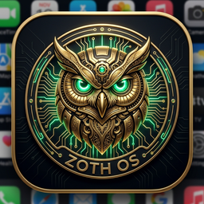
</div>
