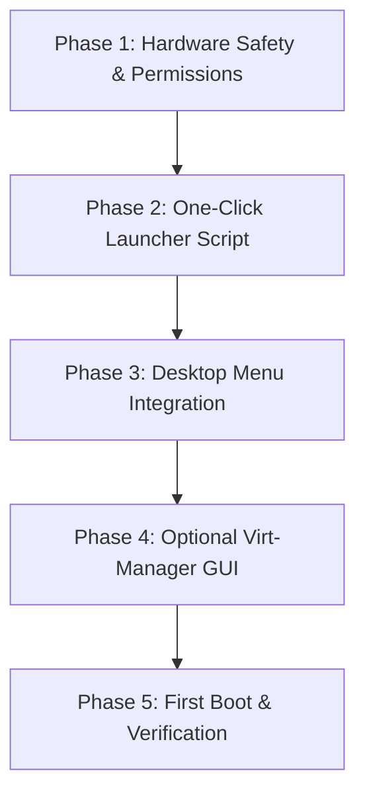

# Roadmap: Running Physical Parrot OS SSD Inside ZothOS via KVM Passthrough

## Executive Summary
This document provides the complete technical blueprint and operational runbook to boot your secondary physical SSD containing **Parrot OS** directly inside **ZothOS** as a high-performance virtual machine. 

This eliminates the need to reboot or shut down your host system to do work in Parrot OS. All changes, installed packages, and files created in the VM are committed directly to the physical drive.

---

## 1. Verified Hardware & Architecture Profile

The system configuration inspected on this machine:

| Component | Host (ZothOS) | Work Drive (Parrot OS) |
| :--- | :--- | :--- |
| **Drive / Bus** | `/dev/nvme0n1` (NVMe PCIe) | `/dev/sda` (SATA 6Gb/s) |
| **Model** | WD Blue SN570 500GB | LITEON CV3-CE512-11 SATA 512GB |
| **Serial / ID** | `TW001D79LOH0079L01KB` | `/dev/disk/by-id/ata-LITEON_CV3-CE512-11_SATA_512GB_TW001D79LOH0079L01KB` |
| **Partition Table** | GPT (`nvme0n1p1` ext4 root, `p2` EFI) | DOS/MBR (`sda1` bootable Btrfs root, `sda2` swap) |
| **Host CPU & RAM** | 24 vCPU Threads | 32 GB Physical RAM (~22 GB available) |
| **Acceleration** | Intel KVM active (`/dev/kvm`) | `qemu-system-x86_64` (v10.0.13) installed |

---

## 2. Implementation Roadmap



---

### Phase 1: Hardware Safety & Drive Access Configuration

> [!CAUTION]
> **Data Integrity Rule**: Never mount `/dev/sda1` on ZothOS while the Parrot VM is running. Simultaneous write access by two independent kernels will corrupt the Btrfs filesystem.

#### Step 1.1: Automatic Unmount Safety
Ensure ZothOS's desktop file manager (Nautilus/Thunar/Dolphin) does not auto-mount `/dev/sda1`. The launcher script will automatically enforce this check before booting.

#### Step 1.2: Grant Non-Root Disk Access to User `zoth`
To launch Parrot OS without needing `sudo` every time (which preserves native Wayland display, audio, and clipboard integration), create a persistent udev rule:

```bash
# File: /etc/udev/rules.d/99-parrot-disk.rules
KERNEL=="sda*", SUBSYSTEM=="block", ENV{ID_SERIAL_SHORT}=="TW001D79LOH0079L01KB", GROUP="kvm", MODE="0660"
```

Apply the rule:
```bash
sudo udevadm control --reload-rules && sudo udevadm trigger
```
Since `zoth` is already a member of the `kvm` group, this gives your user direct read/write permission to the physical drive.

---

### Phase 2: QEMU Raw Disk Launcher Script

Create the launcher script at `~/bin/launch-parrot.sh` or `~/.local/bin/launch-parrot.sh`.

```bash
#!/usr/bin/env bash
set -euo pipefail

DISK_ID="/dev/disk/by-id/ata-LITEON_CV3-CE512-11_SATA_512GB_TW001D79LOH0079L01KB"
RAM_SIZE="12G"      # Allocates 12GB of your 32GB
CPU_CORES="8"       # Allocates 8 of your 24 CPU threads

echo "🔍 Checking safety invariants for Parrot OS physical SSD..."

# 1. Verify disk is present
if [ ! -b "$DISK_ID" ]; then
    echo "❌ Error: Parrot OS physical disk not found at $DISK_ID"
    exit 1
fi

# 2. Invariant Check: Verify NO partition on /dev/sda is mounted on the host
if mount | grep -q "^/dev/sda"; then
    echo "❌ SAFETY HALT: A partition on /dev/sda is currently mounted in ZothOS!"
    echo "Unmounting /dev/sda partitions before proceeding..."
    sudo umount /dev/sda* 2>/dev/null || { echo "Failed to unmount. Aborting."; exit 1; }
fi

echo "🚀 Booting Parrot OS physical drive in KVM accelerated window..."

exec qemu-system-x86_64 \
    -name "Parrot OS (Work Drive)",process="parrot-vm" \
    -enable-kvm \
    -m "$RAM_SIZE" \
    -smp "$CPU_CORES" \
    -cpu host \
    -drive file="$DISK_ID",format=raw,if=ide,cache=none,aio=native \
    -vga virtio \
    -display gtk,gl=on \
    -device virtio-net-pci,netdev=net0 \
    -netdev user,id=net0 \
    -audiodev pipewire,id=snd0 \
    -device intel-hda \
    -device hda-duplex,audiodev=snd0 \
    -usb \
    -device usb-tablet \
    -boot order=c
```

Make it executable:
```bash
chmod +x ~/.local/bin/launch-parrot.sh
```

#### Key Flags Explained:
- `if=ide`: Emulates a native IDE/SATA controller matching Parrot OS's bare-metal install so GRUB and the initial ramdisk boot without missing driver issues.
- `cache=none,aio=native`: Bypasses the host OS page cache so disk writes go straight to the physical SSD safely and quickly.
- `display gtk,gl=on`: Uses hardware OpenGL acceleration inside your Wayland desktop session.
- `usb-tablet`: Prevents mouse cursor trapping, enabling seamless mouse movement between ZothOS and Parrot OS.
- `audiodev pipewire`: Feeds sound directly into ZothOS's running PipeWire server.

---

### Phase 3: Desktop Menu Integration (Application Shortcut)

Create a standard desktop launcher so you can launch Parrot OS directly from your app drawer, docks, or rofi/wofi:

```ini
# File: ~/.local/share/applications/parrot-os.desktop
[Desktop Entry]
Name=Parrot OS (Physical Work Drive)
Comment=Boot Parrot OS physical SSD inside KVM
Exec=/home/zoth/.local/bin/launch-parrot.sh
Icon=utilities-terminal
Terminal=false
Type=Application
Categories=System;Utility;Virtualization;
```

---

### Phase 4: Alternative Management via Virt-Manager (GUI)

If you prefer a full graphical hypervisor interface to adjust settings:

1. Install virt-manager & libvirt:
   ```bash
   sudo apt install -y virt-manager libvirt-daemon-system
   ```
2. In `virt-manager`:
   - Click **Create New Virtual Machine** -> **Import existing disk image**.
   - Browse to path: `/dev/disk/by-id/ata-LITEON_CV3-CE512-11_SATA_512GB_TW001D79LOH0079L01KB`.
   - Set OS Type: **Debian 12** or **Linux**.
   - Configure CPU: 8 cores, Memory: 12288 MB.
   - Check **Customize configuration before install**:
     - Ensure Boot Mode is **BIOS** (since `/dev/sda` uses DOS/MBR partition table).
     - Set Disk bus to **SATA** or **VirtIO** (if virtio drivers are in Parrot's initramfs).
   - Click **Begin Installation**.

---

### Phase 5: Operational Guidelines & Best Practices

| Action | Recommended Practice |
| :--- | :--- |
| **Shutting Down** | Always shut down Parrot OS cleanly from inside Parrot (`Power Off` menu or `sudo shutdown -h now`). Avoid force-killing the QEMU window to protect the physical filesystem. |
| **Bare-Metal Boot** | If you ever choose to restart your machine and boot directly into Parrot OS from your BIOS/UEFI boot menu, you can still do so at any time. |
| **Filesystem Snapshots** | Since `/dev/sda1` is formatted as Btrfs, you can take native subvolume snapshots inside Parrot OS before running updates. |
| **Shared Folders** | For transferring files between ZothOS and Parrot OS, use standard local SSH (`ssh zoth@localhost -p ...`) or setup a 9p virtfs shared folder. |

---

## 3. Quick Reference Command Card

| Task | Command |
| :--- | :--- |
| **Launch Parrot VM** | `launch-parrot.sh` (or click app icon) |
| **Check Disk Status** | `lsblk -o NAME,SIZE,FSTYPE,MOUNTPOINT /dev/sda` |
| **Verify Acceleration** | `kvm-ok` or `cat /sys/module/kvm_intel/parameters/nested` |
| **Kill Process (Emergency Only)** | `pkill -f "parrot-vm"` |
