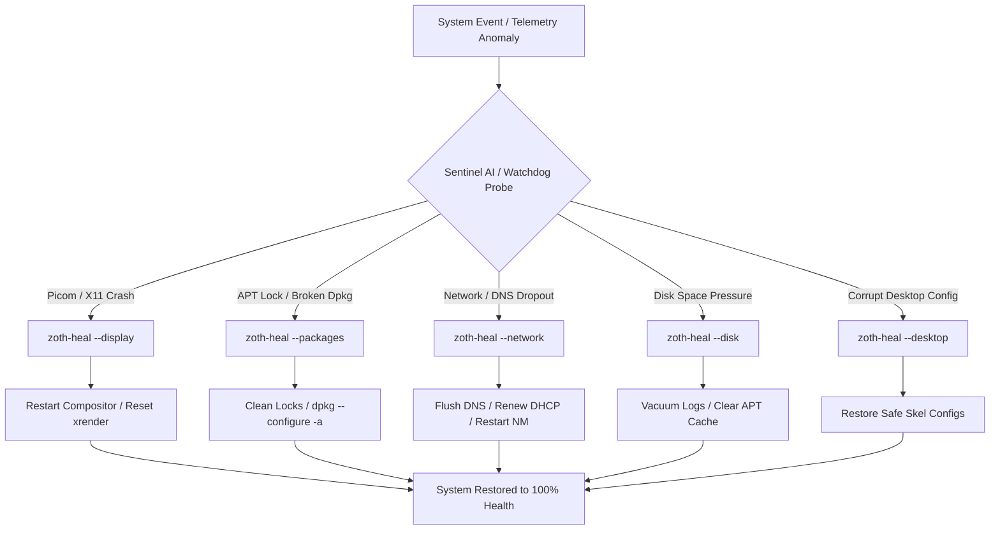

# 🜂 ZOTHOS: THE 10-YEAR IMMORTALITY & SOVEREIGNTY MASTER PLAN (2026–2036)
**Autonomous Operating System Resilience, Air-Gapped Intelligence & Decade-Long Survivability Blueprint**

---

## 🏛️ Executive Summary & Architectural Philosophy

Most specialized Linux distributions fail within 3 to 5 years. The failure modes are predictable:
1. **Upstream Drift & Breakage**: Upstream base changes (Debian/Ubuntu/Arch) break custom toolchains and desktop packages.
2. **Cloud & API Lock-in**: Tools relying on proprietary third-party APIs become inert when endpoints, pricing, or token structures change.
3. **Configuration Bit-Rot**: Incompatible package updates, broken dependencies, and corrupted user config dotfiles degrade the system into unbootable or sluggish states.
4. **Hardware Driver Deprecation**: Transitions across GPU architectures, display servers (X11 to Wayland), and CPU instruction sets leave older ISOs stranded.

**The ZothOS 10-Year Immortality Directive** resolves every failure mode through an architecture of **decoupled layers, hermetic application packaging, sovereign local intelligence, and proactive autonomous self-healing**.

```
┌─────────────────────────────────────────────────────────────────────────────┐
│                       ZOTHOS 10-YEAR SOVEREIGN STACK                         │
├─────────────────────────────────────────────────────────────────────────────┤
│  LAYER 6: SOVEREIGN AI & MCP ARSENAL (Offline LLM / Zero-Cloud Tool Bus)    │
├─────────────────────────────────────────────────────────────────────────────┤
│  LAYER 5: HERMETIC RUNTIMES (AppImages, Flatpaks, Static Binaries, OCI)     │
├─────────────────────────────────────────────────────────────────────────────┤
│  LAYER 4: AUTONOMOUS SELF-HEALING (Sentinel AI + zoth-heal + Watchdog)      │
├─────────────────────────────────────────────────────────────────────────────┤
│  LAYER 3: DESKTOP REALITY ABSTRACTION (XFCE4/Wayland Glassmorphic Dual-Core) │
├─────────────────────────────────────────────────────────────────────────────┤
│  LAYER 2: IMMUTABLE ROOT & SNAPSHOT ROLLBACK (Btrfs/OverlayFS + A/B Boot)    │
├─────────────────────────────────────────────────────────────────────────────┤
│  LAYER 1: ROCK-SOLID KERNEL & BASE OS (Debian LTS Kernel + Live Build)      │
└─────────────────────────────────────────────────────────────────────────────┘
```

---

## 🛡️ Pillar 1: Base OS Decoupling & Immutable Root System

### 1.1 Dual-Track Base Engine (LTS Core + Rolling Overlay)
To prevent upstream breaking changes from crippling the OS:
- **Core Base (Ring 0 & Ring 1)**: Built upon **Debian GNU/Linux LTS** (5-year guaranteed security support per release, extensible to 10 years via Debian ELTS). This hosts the kernel, systemd, networking stack, and core display drivers.
- **Security & Exploitation Tools (Ring 2)**: Kali Rolling and Parrot OS security repositories are mounted as secondary overlays with strict APT pinning (`/etc/apt/preferences.d/zothos-pinning.pref`). If upstream Kali alters a core library, ZothOS pinning protects the base system from destabilization.

### 1.2 Atomic A/B Partitions & Snapshot Rollback (`zoth-rollback`)
- Default installations utilize **Btrfs** with automated pre-update snapshotting (`snapper` / `zoth-snapshot`).
- In case of failed boots, kernel panics, or broken upgrades, GRUB provides an instant 1-click boot option:
  `ZothOS [Restore Immutable Gold Master - 2026.1]`.
- An integrated recovery script (`zoth-rollback`) allows immediate instantaneous reversion of `/etc`, `/usr`, and `/var` to any verified milestone.

---

## ⚡ Pillar 2: Hermetic Packaging & Zero-Dependency Execution

### 2.1 The "Run Everywhere in 2036" Standard
Every mission-critical application in ZothOS must execute identically today and in 2036:
- **Zoth Studio Pro**: Packaged as a standalone **AppImage** and static directory bundle (`/opt/zoth-studio`) embedding its own WebKit/Chromium runtime and lightweight Python HTTP backend. It requires zero external shared library dependencies from the host.
- **NullAI HexStrike AI Terminal**: Bundled with internal virtual environments and pre-compiled React UI assets (`ui/dist`).
- **Core Security Suite**: Critical binaries (Nmap, Masscan, Wireshark, Radare2, Ligolo-ng, Caido) are bundled with statically linked dependencies or isolated root chroots.

### 2.2 Flatpak & Container Sandboxing
- Dynamic, experimental, or user-installed packages run inside sandboxed Flatpak or rootless OCI containers (`podman` / `docker`), guaranteeing that user experimentation cannot corrupt system libraries.

---

## 🧠 Pillar 3: Sovereign Local AI & Zero Cloud Lock-In

### 3.1 Local Offline Inference First
Cloud APIs can be deprecated, censored, or restricted at any moment. ZothOS achieves decade-long autonomy by guaranteeing **100% offline intelligence**:
- **Default Local Model Engine**: Native integration with `llama.cpp` and `ollama` with GPU/CPU acceleration.
- **Pre-Seeded Micro-Models**: Built-in 1B to 3B parameter models (such as Llama-3.2-1B, Qwen2.5-Coder-1.5B) capable of offline terminal assistance, code syntax analysis, and log telemetry parsing on standard CPU hardware.
- **Multi-Provider Tiering**:
  1. `Tier 0 (Air-Gapped)`: Local embedded GGUF weights via `llama.cpp` / `ollama`.
  2. `Tier 1 (LAN Swarm)`: Local network inference server (vLLM / Ollama node).
  3. `Tier 2 (BYOK Sovereign Cloud)`: Direct API access to Anthropic Claude, OpenAI, DeepSeek, xAI Grok, Google Gemini, and OpenRouter.

### 3.2 Offline MCP (Model Context Protocol) Bus
- Standardized tool bus (`/etc/zothos/mcp-servers.json`) providing deterministic JSON-RPC interfaces for system introspection, network probes, file operations, and security tools.
- Works offline without internet egress.

---

## 🩺 Pillar 4: Autonomous Self-Healing & Health Monitoring

### 4.1 Multi-Tiered Self-Healing Engine
The system contains an automated diagnostic and auto-repair matrix:



### 4.2 Proactive Daemon Suite:
- **`zoth-sentinel`**: Background system supervisor monitoring CPU anomalies, memory leaks, zombie threads, and port conflicts.
- **`zoth-heal`**: Deterministic repair script covering 7 core subsystems.
- **`zoth-doctor`**: Comprehensive environment auditor with `--fix` automated resolution.
- **`zoth-watchdog.timer`**: Autonomous 15-minute background validation cycle.

---

## 🌐 Pillar 5: Decentralized Mirroring & Repository Resilience

To survive the potential shutdown or blocking of central package mirrors:
1. **Decentralized Mirror Registry**: Multiple fallback repository mirrors defined across Debian, Kali, Parrot, and local ZothOS mirrors.
2. **Local Mirror Generator (`zoth-mirror-sync`)**: Allows users to clone a complete, air-gapped 40GB offline package repository onto an external encrypted NVMe drive.
3. **P2P Torrent / IPFS Distribution**: Live ISO images and offline artifact bundles are distributed via verified BitTorrent magnet links and IPFS content hashes.

---

## 🖥️ Pillar 6: Hardware Portability & Multi-Architecture Roadmap

| Architecture | 2026 Target | 2030 Target | 2036 Target |
| :--- | :--- | :--- | :--- |
| **x86_64** | UEFI + Legacy BIOS (QEMU, Bare Metal, Framework, ThinkPad) | Optimized AVX-512 & Hybrid P/E Core Scheduling | Extended LTS & Legacy Hardware Support |
| **ARM64 (aarch64)** | Apple Silicon (UTM / Parallels / QEMU) + Raspberry Pi 5 | Native ARM64 ISO Builds & Snapdragon X Elite | Embedded Field Deployment Nodes |
| **RISC-V** | Experimental QEMU Emulation | Developer Devboard Support | Sovereign Hardware Appliance ISOs |

---

## 🔒 Pillar 7: Operational Security & Amnesic Ghostmode

### 7.1 Amnesic Live Operation
- Boots into pure RAM (RAM-disk execution) leaving zero forensic traces on host storage.
- Volatile RAM purge on shutdown using kernel memory scrubbers.

### 7.2 Emergency Killswitch (`99-zoth-panic.rules` & `zoth-netkill`)
- Instant network severance, MAC address randomization, and memory scrubbing via hotkey or USB hardware removal token.

---

## 📅 10-Year Execution Roadmap & Milestones

```
2026 ────────────────► 2028 ────────────────► 2031 ────────────────► 2036
v3.7 PRO               v4.0 LTS              v5.0 IMMORTAL         v6.0 APEX
• Self-Healing v1      • Btrfs A/B Rollback  • Full Offline LLM    • Decadal Verification
• Dual-Core Repos      • Native AppImages    • Decentralized P2P   • Complete Air-Gap
• XFCE Glass Theme     • Hybrid Wayland Bus  • Multi-Arch ARM/x86  • Quantum-Safe Crypto
```

---
*Authored & Sealed for ZothOS Sovereign Core — 2026 to 2036 and Beyond.*
